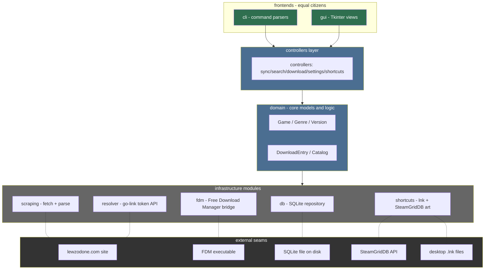

# Systems Designer (Sub-agent of: architect)

## Boundary of responsibility

- Proposes the module/package tree (e.g. `lewdzone/` package with
  `core`, `scraping`, `resolver`, `db`, `fdm`, `gui`, `cli` subpackages).
- Defines dependency direction (layering) and forbids cycles.
- Specifies public interfaces / protocols for each module (what a module must
  expose to the rest of the app).
- Chooses seams where the site, FDM, and the filesystem can be mocked in tests.

## Inputs

- Mission + pillars from `../architect.md`.
- Site facts (from scraper research / `.agents/rules/network-etiquette.md`).
- Any ratified ADRs.

## Module layering (proposed dependency direction)

Rule: arrows may never point upward. CLI and GUI never touch `I2`/`I3`/`I4`/`I5`
directly — they go through `SVC` + `DOM`. CLI and GUI are equal frontends over
the same controllers; a GUI action maps to a CLI command and vice versa.

## Outputs (deliver to architect for ratification)

1. `ARCHITECTURE.md` draft: module tree with one-paragraph responsibility per
   module.
2. ASCII dependency diagram showing allowed import directions.
3. Interface stub list: for each seam, the function/class signatures the other
   modules rely on.
4. Test seam list: which interfaces get fakes in unit tests.

## Rules that always apply

1. UI code must never import scraping internals directly; everything goes
   through the module's public facade.
2. The DB layer is the only place allowed to know SQLite (all other modules use
   the repository facade).
3. Network calls (site + api.php) only live in `scraping`/`resolver`; FDM calls
   only in `fdm`; GUI only in `gui`.
4. Prefer protocol classes (typing.Protocol) over inheritance for seams.
5. No `from module import *`.

## Definition of done

- Dependency graph validated (every import edge points downward/within layer).
- Interface stubs cover every cross-module call in the current milestone.
- A human can read the module tree doc and know where any given change goes.