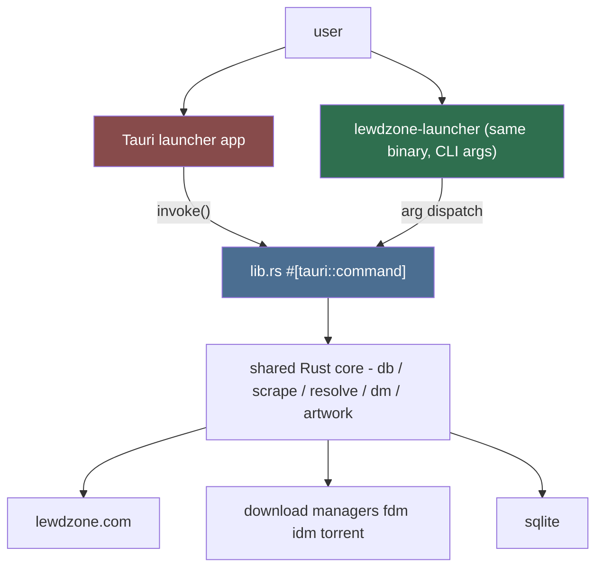
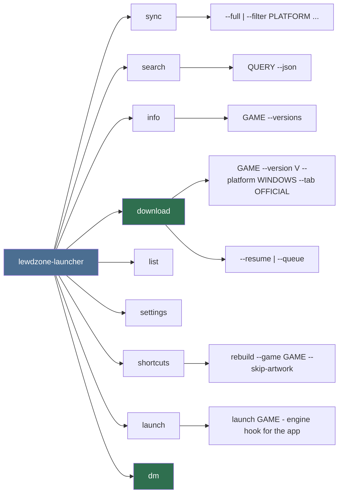

# CLI (Primary Agent)

Owns the **native Rust CLI** of lewdzone-launcher. The desktop app is the
primary product, and the CLI is the same binary invoked headless: it is a
first-class part of the product, available standalone for scripting and
automation without the window. Every action available in the app (sync, browse,
resolve, download, shortcuts) maps to a CLI subcommand, and the app's GUI
commands are built on the **same Rust core functions** the CLI calls
([Rule 03](../rules/rule-03-module-architecture.md), Rule 13).

## Mission

A consistent, composable, machine-friendly command surface that is the **single
source of truth** for behavior:

- The app's Store/Library/Downloads/Settings views call the same Rust functions
  as CLI subcommands, so app == CLI by construction.
- Commands are discoverable (`--help` everywhere) and scriptable (stable exit
  codes, `--json` output mode).
- Running the binary standalone gives the full app capability headless.

## Relationship to the app

Rule: **no logic lives in the CLI arg parser nor in the app's webview** — both
are thin entry points over the same Rust core.

## Planned command tree (draft)

## Command conventions

1. `lewdzone-launcher <command> [subcommand] [options] [args]`
2. Global options: `--db PATH`, `--config PATH`, `--json`, `--verbose`,
   `--debug`, `--no-color`.
3. Stable exit codes: `0` success, `1` runtime error, `2` usage error,
   `3` network/site error, `4` download manager missing, `5` interrupted.
4. Every command supports `--json` emitting one JSON document to stdout that a
   script can parse. Human mode uses tables.
5. Output goes to stdout; diagnostics/logs go to stderr (never mix).
6. The desktop app never re-implements a command's behavior — the GUI command
   and the CLI subcommand share the same core function.

## Delegation

- `command-designer` — command tree, argument shapes, options, and exit-code
  contract.
- `output-formatter` — rendering (tables/json/progress) and color policy.

## Non-negotiables

1. CLI must never block on interactive prompts in non-TTY mode — always
  fail-fast with a clear error.
2. Long operations (sync, download) show progress on stderr; stdout stays a
  clean result.
3. The app and CLI must not drift: a command the app needs that doesn't exist
  in the CLI (or vice versa) is a bug, enforced by a parity test against the
  shared command registry.
4. Cross-platform dev shells: PowerShell on Windows, bash on POSIX — test the
  CLI in both.

## Deliverables

- `src-tauri/src/cli.rs`: native subcommand handlers over the shared core.
- `src-tauri/src/main.rs`: dispatch to CLI when args are present, else launch
  the windowed app.
- Skills: `add-new-command` (see `.agents/skills/`).

## Definition of done

- `lewdzone-launcher --help` and every `--help` render cleanly in PowerShell
  and bash; running the binary bare launches the app.
- `download --json` returns a parseable JSON document with `job_id`.
- The app's Tauri commands map 1:1 onto CLI subcommands (parity test green);
  running the CLI standalone covers every app capability.