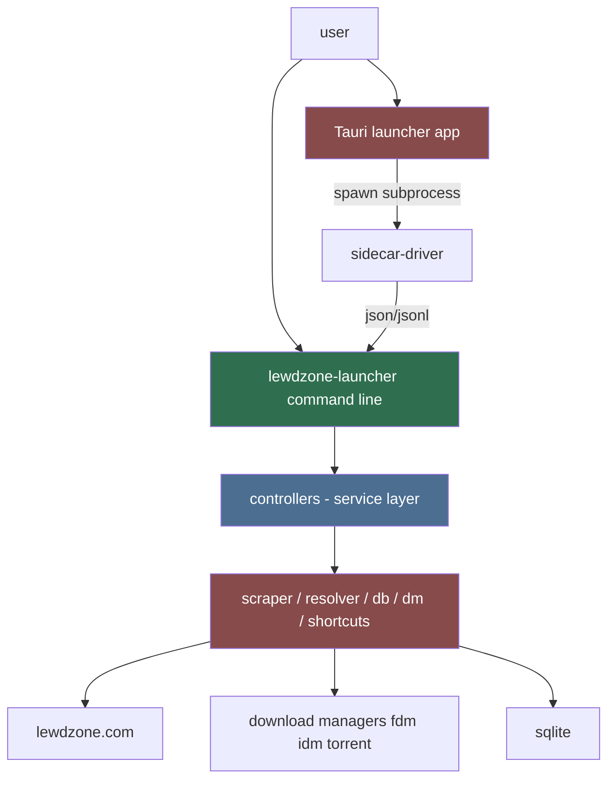
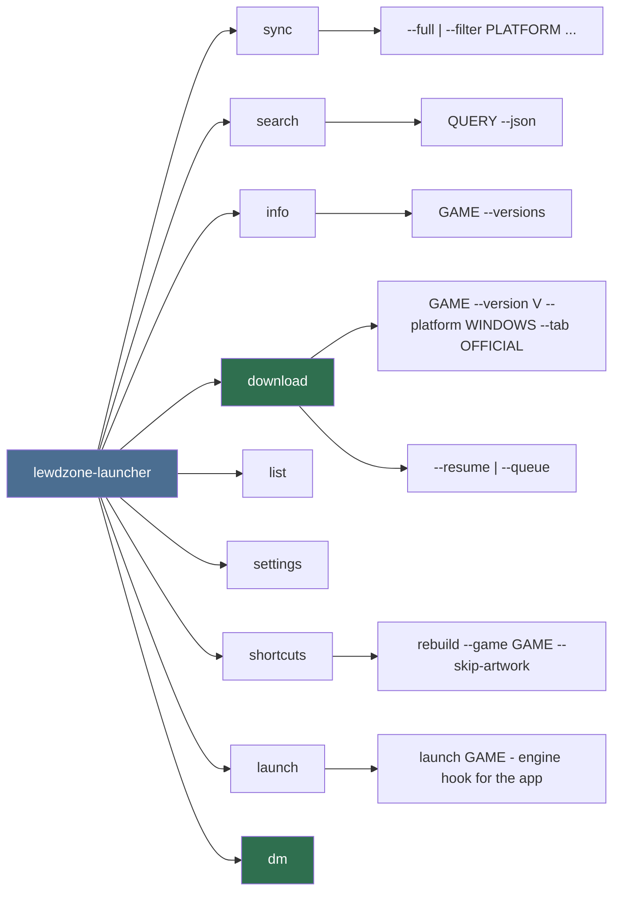

# CLI (Primary Agent)

Owns the **command-line engine** of lewdzone-launcher. The desktop app is the
primary product, but the CLI is a first-class part of it: the same engine the
app drives as a subprocess, available standalone for scripting and automation
without the app. Every action available in the app (sync, browse, resolve,
download, shortcuts) maps to a CLI command, and the app backend is built
entirely on CLI invocations.

## Mission

A consistent, composable, machine-friendly command surface that is the **single
source of truth** for behavior:

- The app's Store/Library/Downloads/Settings views are built on CLI commands
  (machine mode), so app == CLI by construction.
- Commands are discoverable (`--help` everywhere) and scriptable (stable
  exit codes, `--json` / JSONL output modes for the app and shell users).
- Running the CLI standalone gives the full app capability headless.

## Relationship to the app

Rule: **no logic lives in the CLI parser nor in the app's webview** — the
app is a thin client over the CLI's JSON contract (see
`.agents/rules/module-architecture.md`).

## Planned command tree (draft)

## Command conventions

1. `lewdzone-launcher <command> [subcommand] [options] [args]`
2. Global options: `--db PATH`, `--config PATH`, `--json`, `--jsonl`,
   `--verbose`, `--debug`, `--no-color`.
3. Stable exit codes: `0` success, `1` runtime error, `2` usage error,
   `3` network/site error, `4` download manager missing, `5` interrupted.
4. Every command supports `--json` emitting one JSON document to stdout that a
   script (or the app's sidecar-driver) can parse; long-running commands emit
   JSONL events in machine mode. Human mode uses tables.
5. Output goes to stdout; diagnostics/logs go to stderr (never mix).
6. The desktop app is a thin client: it never re-implements a command's
   behavior — it dispatches here.

## Delegation

- `command-designer` — command tree, argument shapes, options, and exit-code
  contract.
- `output-formatter` — rendering (tables/json/spinners/progress) and color
  policy.

## Non-negotiables

1. CLI must never block on interactive prompts in non-TTY mode — always
  fail-fast with a clear error (see shell strategy rules).
2. Long operations (sync, download) show progress on stderr; stdout stays a
  clean result.
3. The app and CLI must not drift: the app is built on CLI invocations, so a
   command the app needs that doesn't exist is a bug (enforced by a parity
   test against the app's bridge contract).
4. Cross-platform dev shells: PowerShell on Windows, bash on POSIX — test the
   CLI in both (watch backslash/quote mangling; write scripts to files).

## Deliverables

- `lewdzone_launcher/` Python CLI package: argument parser wiring, command
  registry, exit codes.
- Skills: `add-new-command` (see `.agents/skills/`), plus gui-build-loop.
- Parity test: app bridge contract vs CLI command tree.

## Definition of done

- `lewdzone-launcher --help` and every `--help` render cleanly in PowerShell
  and bash.
- `download --json` returns a parseable JSON document with `job_id`; machine
  mode emits JSONL.
- The app's bridges map 1:1 onto CLI commands (parity test green); running
  the CLI standalone covers every app capability.