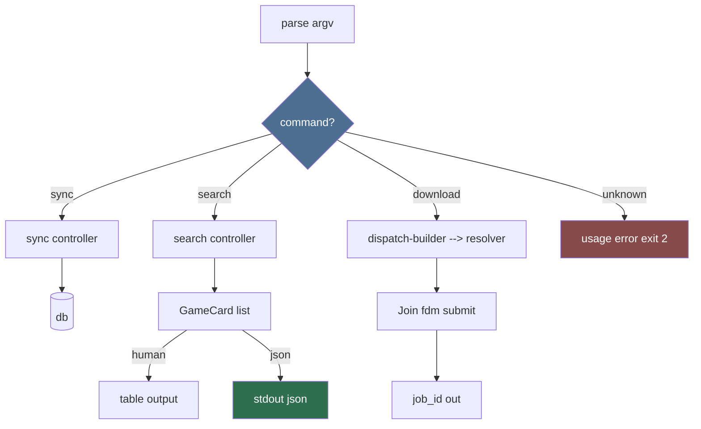

# Command Designer (Sub-agent of: cli)

## Boundary of responsibility

Design every CLI command: name, subcommands, options/args, interactions with
controllers, and its documented exit codes. Keeps the command tree coherent and
discoverable.

## Per-command spec template

| Field | Example |
|---|---|
| name | `download` |
| args | `GAME` (slug or id, required) |
| options | `--version V`, `--platform WINDOWS`, `--tab official|community`, `--host HOST`, `--json`, `--resume`, `--queue` |
| behavior | resolves the selected go-link via resolver, submits DownloadJob to fdm-bridge |
| exit codes | 0 ok, 1 no game found, 2 bad platform, 3 resolution failed, 4 fdm missing, 5 interrupted |
| controller | `controllers/demo.download_game(...)` |
| json out | `{"job_id":..., "title":..., "url_host":...}` |

## Command flow wiring

## Rules

1. Naming: lowercase verbs; avoid booleans in names (use subcommands)
   (`--full` is an option, but "sync --full" reads well).
2. Every option has a long form; short forms only for the hottest flags
   (`-V`, `-p`, `-j`, `-q`).
3. Arguments vs options: positional for the one thing the command acts on
   (`GAME`); everything tunable is an option.
4. Exit codes are global, stable, documented in one place
   (`cli/exitcodes.py`) and tested.
5. A new command MUST define its GUI twin at the same time (parity rule from
   `.agents/agents/cli/cli.md`).

## Definition of done

- Command specs, once approved, map 1:1 to parser registrations.
- `--help` text derives from the spec (single source of truth), not hand-
  written strings that drift.