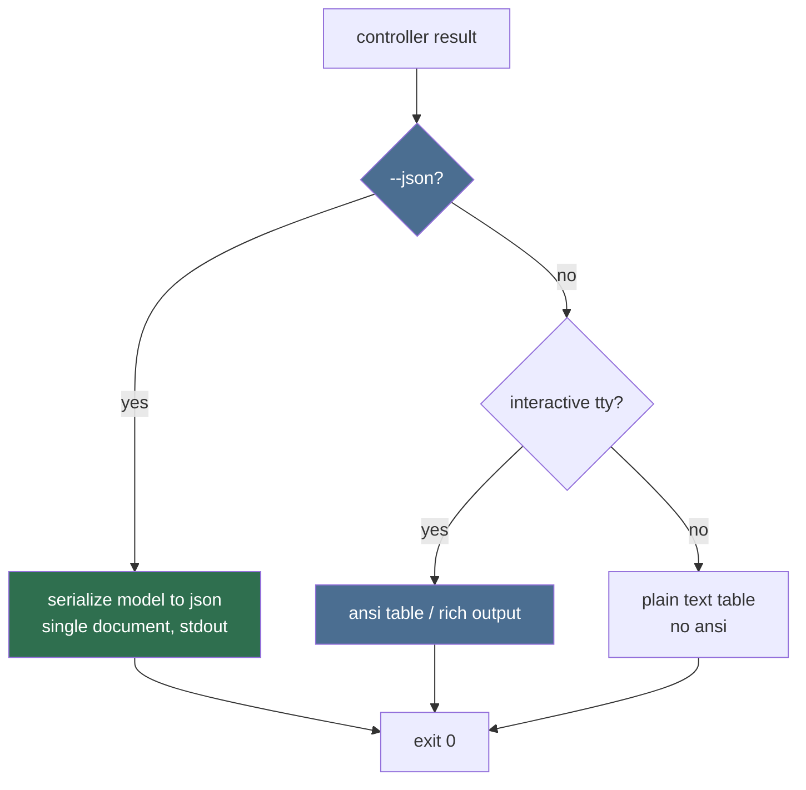

# Output Formatter (Sub-agent of: cli)

## Boundary of responsibility

All rendering of command results: human tables, `--json` documents, progress
bars, spinners, ANSI color, and the "never mix stdout/stderr" discipline.

## Format selection

## JSON contract

- One document per command on stdout; arrays when the result is a list.
- Keys are snake_case, stable, documented per command.
- Nested models serialize via serde (shared with the GUI/DB layer) — one
  serializer, many consumers.
- Errors in `--json` mode: emit a JSON error object to stdout AND exit with
  the command's error code (so scripts get structured failures).

## Progress & logs

- Progress bars/spinners go to **stderr** only.
- `--verbose`/`--debug` raise log level; default shows warnings+.
- Colors (ANSI) auto-disabled when not a TTY or when `--no-color`.

## Rules

1. Never `println!()` debug info to stdout from controllers; all diagnostics
   via the log/tracing facade -> stderr.
2. Tables truncate long cells deterministically; fixed column widths; sorting
   is stable.
3. Unicode-safe: use a rendering lib and wrap all cells (`str`), never crash
   on exotic titles (see `.agents/rules/error-handling.md`).

## Definition of done

- Golden-file tests for `search --json` and `list --json` output.
- A non-TTY run produces zero ANSI codes; table and JSON stay line-stable.