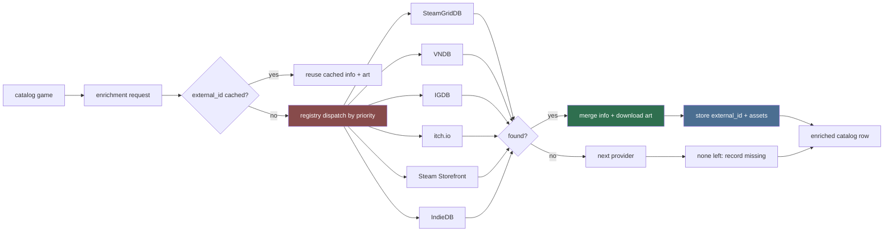

# Content Providers (Primary Agent)

Not every LewdZone game page carries complete metadata — titles from indie and
amateur developers routinely lack descriptions, release dates, screenshots,
and art. This family closes that gap with a **pluggable provider layer** that
enriches the catalog and feeds the shortcuts/artwork pipeline.

## Mission

1. Define the `ContentProvider` adapter contract and `PROVIDERS` registry.
2. Enrich game info from external databases (VNDB, IGDB, Steam Storefront,
   itch.io, IndieDB) — description, developer, release metadata, screenshots,
   ratings, tags, store links.
3. Supply artwork (icons, cover/grid, hero, logo) from any provider that has
   it (SteamGridDB primary for icons; VNDB/itch for covers; Steam for capsules).
4. Persist enrichment + external IDs in the DB so rebuilds are offline-fast.
5. Degrade gracefully: LewdZone scrape stays the **source of truth** for
   downloadability (versions, platforms, hosts). Providers only ADD missing
   detail; a provider's absence never breaks listing or downloading.

## Principle

- LewdZone data is authoritative for *downloads*.
- Provider data is authoritative for *presentation* (info + art).
- Never overwrite a LewdZone-scraped field with a provider value; only fill
  gaps and store provider refs alongside.

## Provider layer



## Adapter contract

```python
class ContentProvider(Protocol):
    name: str                       # registry key
    provides_info: bool             # enriches metadata
    provides_art: bool              # supplies image assets
    requires_key: bool              # needs configured API key
    def search(self, title: str) -> list[ProviderCandidate]: ...
    def fetch_info(self, c: ProviderCandidate) -> GameInfoPatch | None: ...
    def fetch_asset(self, c: ProviderCandidate, kind: AssetKind) -> Path | None: ...
```

- `AssetKind`: `icon` | `grid` | `hero` | `logo` | `cover` | `screenshot`.
- `ProviderCandidate`: `{provider, external_id, title, score, meta}`.
- `GameInfoPatch`: optional fields only: `description`, `developer`,
  `release_date`, `screenshots`, `rating`, `tags`, `store_url`.
- Registry: `PROVIDERS = {"steamgriddb": ..., "vndb": ..., "igdb": ...,
  "itch": ..., "steam": ..., "indiedb": ...}` under
  `src/lewdzone_launcher/services/content/providers/`; dispatch order is a
  priority list policy, overridable via `settings`.

## Provider roster (v1)

| Provider | name | search | info | art | key | notes |
| --- | --- | --- | --- | --- | --- | --- |
| SteamGridDB | `steamgriddb` | autocomplete | no | icons/grids/heroes/logos | ✅ Bearer | `nsfw=yes` param for mature titles |
| VNDB (Kana) | `vndb` | POST /vn | description, developer, rating, tags, screenshots | cover + screenshots | none | Best coverage for adult VNs (Ren'Py/RPGM) |
| IGDB (v4) | `igdb` | POST /games + /search | description, genres, screenshots | covers/artworks | ✅ Client-ID + token | Twitch OAuth; mainstream + mid-size games |
| itch.io | `itch` | scrape `{author}.itch.io/{slug}` + search page | description, dev, price, platforms | cover, screenshots | optional | Indie hub; matches many LewdZone titles |
| Steam Storefront | `steam` | needs external mapping | description, screenshots, capsule art | capsule/header/library | none | Only for titles on Steam (no search) |
| IndieDB | `indiedb` | scrape search | description, images | images | none | No public API (confirmed); HTML scrape only |

## External-id persistence

- New DB table `game_external`: `(post_id FK, provider, external_id,
  title, fetched_at)` — one row per successful provider match.
- `artwork_cache` gains `provider` + `kind` columns so the same game can hold
  a SteamGridDB icon and a VNDB cover simultaneously.
- Enrichment is idempotent: re-running never duplicates rows (upsert on
  `(post_id, provider)`).

## Settings (surfaced in the app's Settings page)

| Key | Provider | Meaning |
| --- | --- | --- |
| `sgdb_api_key` | steamgriddb | Bearer key (profile/preferences) |
| `igdb_client_id` | igdb | Twitch client id |
| `igdb_client_secret` | igdb | Twitch app access token exchange |
| `content_priority` | — | provider dispatch order (comma list) |
| `content_providers_enabled` | — | which providers are on (e.g. `vndb,itch`) |

Keys are stored in `~/.config/lewdzone` or env (Rule 10) — the Settings page
renders paste fields and never returns stored keys to the UI.

## Delegation

- `provider-registry` — the adapter contract, `PROVIDERS`, priority policy,
  settings keys, and fake contracts for tests.
- `steamgriddb-provider` — icons/grids/heroes/logos, `nsfw=yes`, .ico conversion handoff.
- `vndb-provider` — Kana API client, info + cover/screenshots, no key.
- `igdb-provider` — Twitch OAuth token fetch + v4 client, info + covers/artworks.
- `itch-provider` — page scrape, cover/screenshots + info.
- `steam-provider` — Storefront appdetails, capsule/header art + info (mapped ids only).
- `indiedb-provider` — search + game-page scrape, images + info.

## Non-negotiables

1. LewdZone download data is never overwritten by provider data.
2. Provider calls obey network etiquette (1 req/s per domain, retry ≤3,
   offline fixtures, live-only tests) — Rule 05.
3. New providers implement the contract, register in `PROVIDERS`, add fakes in
   `tests/support/`, and ship a settings row — they are additive.
4. Missing keys/provider outages degrade to "no enrichment", never to a
   hard failure of listings or downloads.
5. NSFW filtering respects each provider's policy (SteamGridDB `nsfw=yes`,
   VNDB `image.sexual`/`image.violence` flags deciding cover candidacy).

## Deliverables

- `services/content/` package: `contract.py`, `registry.py`, `providers/`
  (six v1 adapters), `enrichment.py` merge/patch logic.
- DB tables via `database/schema-designer`: `game_external` (+ `artwork_cache`
  columns `provider`, `kind`).
- Skill: `enrich-game-and-art` (provider-agnostic dispatch).
- Template: `content-provider` adapter template (see `.agents/templates/`).

## Definition of done

- "Treasure of Nadia" enriches end-to-end: VNDB description/rating + SteamGridDB
  icon + VNDB cover, all cached in DB, offline second run.
- A LewdZone-only title with no external match still lists and downloads with a
  generic icon fallback.
- One opt-in live test per provider; all unit tests run offline with fakes.