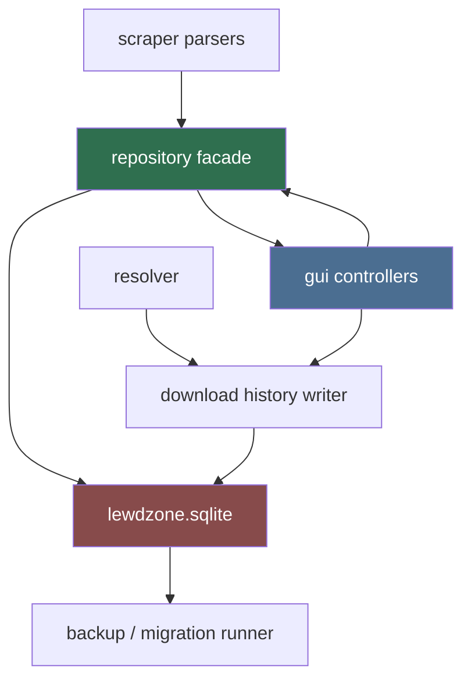
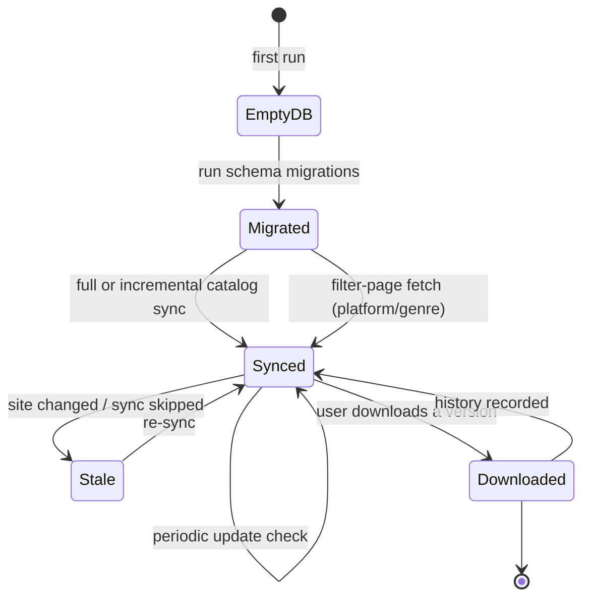

# Database (Primary Agent)

Owns everything persisted in SQLite: the game catalog, genres, versions,
download links/history, host allowlist, and settings. The DB is the **single
source of truth** that the GUI reads and the scraper/resolver feed.

## Mission

Design and maintain a schema that survives site changes, makes offline
browsing possible, and tracks what the user has downloaded (with organized
folders as the filesystem mirror).

## Architecture (who touches what)

Only `database` family code knows SQLite. Everything else talks to the
repository facade (`GameRepository`, `DownloadRepository`, `SettingsRepository`).

## Data lifecycle

## Non-negotiables

1. WAL mode + `foreign_keys=ON` at every connection.
2. All schema changes go through the migration runner
   (`migrations/00x_*.sql`) — never ad-hoc DDL in app code.
3. Store tokens/go-links and metadata, NOT transient resolved URLs (they
   expire). Resolved URLs are ephemeral, produced on demand by the resolver.
4. Every table uses `INTEGER PRIMARY KEY` ids plus stable site keys
   (`post_id`, `genre slug`, `host slug`).
5. Never store the site's obfuscated `u` payload — treat as opaque and drop.

## Deliverables

- `src-tauri/src/db.rs`: connection factory, migrations runner, repositories.
- Schema owned with `schema-designer`; sync logic with `sync-orchestrator`.
- Backups: `PRAGMA` + copy of the `.sqlite` file on major migrations.

## Definition of done

- Schema v1 applies cleanly to a fresh SQLite file (migration runner tested).
- Sync of one game + its versions + links round-trips into the repo and back
  out identical.
- `WAL` and `foreign_keys` pragmas verified at runtime in tests.