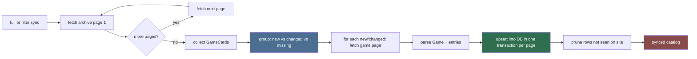
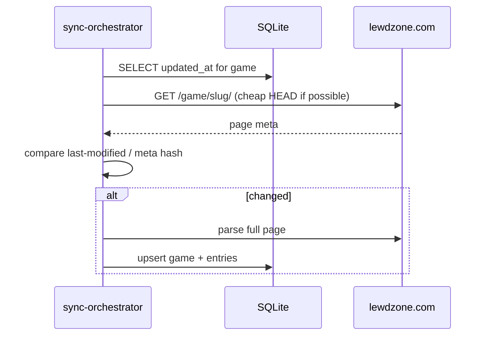

# Sync Orchestrator (Sub-agent of: database)

## Boundary of responsibility

Coordinate scraper parsers + fetch helper to fill the DB, and keep it fresh:

- Full sync (all archive pages, all games).
- Targeted sync by filter/genre.
- Incremental update check (has this game changed since `updated_at`?).
- Prune deleted games / entries when the site removes them.

## Sync pipeline

## Sync rules

1. **Batching**: commit per-page, not per-game; wrap page parse + upsert in one
   transaction.
2. **Politeness**: min delay between fetches; resumable (record last successful
   page/offset in a `sync_state` table so a crash continues, not restarts).
3. **Idempotent upserts**: same slug/post_id -> update, never duplicate.
4. **Pruning policy**: only prune when a full sync completes without errors; a
   partial/failed sync must NOT delete rows (avoid mass wipe on transient site
   errors).
5. **Post IDs are the stable identity**; slug can change if the site renames a
   permalink.

## Incremental check flow

## Definition of done

- Full sync of fixture-based catalog completes with resume-after-failure test.
- Prune never runs on a failed/partial sync (regression test covers this).
- Upsert is provably idempotent (run twice -> same row count).