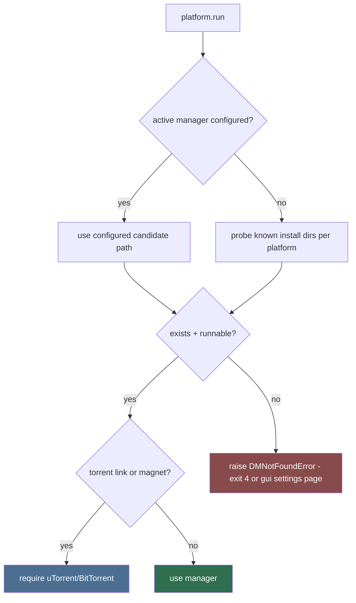

# DM Detector (Sub-agent of: dm)

## Boundary of responsibility

Inventory all installed download managers on the current platform, pick the
user's active one, verify the binary works, and spawn it without interactive
prompts. The tool never hard-depends on a single download manager: any
installed manager (or none) must be handled gracefully.

## Per-manager detection table

| Manager | Platform | Detection order | Launch |
| --- | --- | --- | --- |
| FDM | Windows | `settings.override` → `C:\Program Files\Free Download Manager\fdm.exe` → x86 → `%LOCALAPPDATA%` scan | `fdm.exe -fs "<url>"` |
| IDM | Windows | `settings.override` → `C:\Program Files (x86)\Internet Download Manager\IDMan.exe` → `%LOCALAPPDATA%` scan | `IDMan.exe /d <url> /n /p <target_dir>` |
| uTorrent / BitTorrent | Windows, Linux, macOS | `settings.override` → PATH (`uTorrent`/`ut`/`bittorrent`) → well-known install dirs | `<bin> <magnet-or-torrent-path>` |
| Downloads-folder fallback | all | folder browser | none — direct save |

## Detection order

## Cross-platform spawn safety rules

1. Windows: `std::process::Command` with `CREATE_NO_WINDOW` (`creation_flags`)
   so no console flashes. POSIX: spawn detached (setsid).
2. Never spawn via a shell; build the argv array — URLs come from the network.
3. Silent flags are MANDATORY: FDM `-fs`; IDM `/n` (start download without
   confirmation dialog); torrent CLIs take the magnet/`.torrent` as a bare
   argument. Never fall back to an interactive dialog.
4. Guard: if the active manager isn't installed, fail fast with a friendly,
   actionable message rather than hang.
5. Config location is platform-aware: `%APPDATA%` (Windows),
   `$XDG_CONFIG_HOME` or `~/.config` (Linux), `~/Library/Application Support`
   (macOS). Same for download root defaults.
6. Keep all spawning behind the `DMBridge` seam so unit tests substitute a
   fake exe (see `testing/mock-engineer`).

## Verification

- A smoke test launches each manager with a harmless URL only when marked
  live (opt-in, tagged `#[ignore]`). CI never invokes
  a real download manager.
- Unit tests assert argv shape per manager:
  - FDM: `["<path>\\fdm.exe", "-fs", url]`
  - IDM: `["<path>\\IDMan.exe", "/d", url, "/n", "/p", target_dir]`
  - Torrent: `["<path>\\uTorrent.exe", magnet]`
- Detection tests run on all three platforms via the platform seam (see
  `architect/systems-designer`).

## Definition of done

- Detection covers override + defaults on Windows/Linux/macOS and returns a
  clean `DMNotFoundError` otherwise.
- Spawn tests prove no shell, no window (Windows), silent flags present.