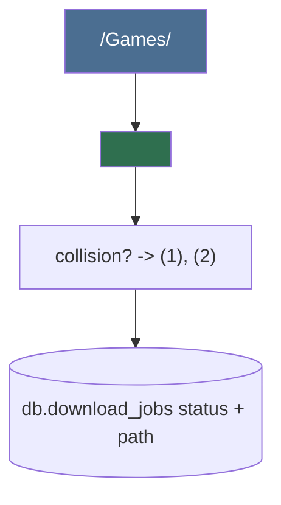

# Download Manager (dm) family

## Mission

lewdzone-launcher is a desktop CLI (with GUI twin) that runs on **Windows, Linux, and
macOS**. Download handling is runtime-injected through a **pluggable adapter**
so the tool supports whatever download manager the user already has installed.

The single hard rule: lewdzone-launcher never performs the file download itself.
It resolves the real URL (see `resolver`), then hands it to an installed
download manager. If none is installed, the tool fails fast (exit code 4) and
points the user at supported managers — it never silently degrades to a
half-baked built-in downloader.

## Why adapters, not one hard-coded manager

- FDM is Windows-only; a Windows-first design would break Linux/macOS users.
- Real users already own diverse managers (FDM, IDM, uTorrent/BitTorrent).
- The adapter seam lets every external manager be faked in tests
  (`testing/mock-engineer`), keeping the suite offline and fast.
- "More" managers later = one new adapter + one detector entry, not a rewrite.

## Adapter contract

### Shared contract (every adapter implements)

- `name` — canonical adapter id (`fdm`, `idm`, `utorrent`).
- `platforms` — supported OSes (`win32` and/or `linux`, `darwin`).
- `handles_kind` — `http` (direct file) and/or `torrent` (magnet/`.torrent`).
- `detect() -> Path | None` — locate the binary (see dm-detector table).
- `launch(url: str, target_dir: Path, filename: str) -> None` — spawn silently.
- `confirm_launch(job) -> bool` — optional per-manager post-spawn check.

All adapters live in `lewdzone_launcher/services/dm/adapters/` and register through
a `MANAGERS: dict[str, DownloadManager]` registry. Dispatch is
`MANAGERS[settings.active_manager]`; if the active manager is missing on the
current platform, list the discovered alternatives in the error.

## Folder organization

Every completed download is folded into the organized library
(`folder-organizer` sub-agent):

Movers: `move` (default), `copy`, `link` — user setting `mover_mode`.

## Sub-agent roster

| Sub-agent | Ownership |
| --- | --- |
| `dm-detector` | cross-platform binary detection + safe spawn |
| `fdm-adapter` | FDM (Windows) silent CLI |
| `idm-adapter` | IDM (Windows) silent CLI |
| `torrent-adapter` | uTorrent / BitTorrent (all platforms) magnet & `.torrent` |
| `folder-organizer` | canonical naming, moving, collision handling |

## Cross-platform responsibilities

- Paths: always `pathlib.Path`, never string concat.
- Config dirs: `%APPDATA%\lewdzone` (Windows) / `~/.config/lewdzone`
  (Linux) / `~/Library/Application Support/lewdzone` (macOS) — resolved by a
  single `platform` seam (`lewdzone_launcher/core/platform.py`).
- Process spawn: `CREATE_NO_WINDOW` only on Windows; POSIX uses
  `start_new_session=True`. Both use `shell=False`.
- No manager installed on the current platform → exit code 4 with the list of
  installable managers.

## Definition of done (family level)

- Registry maps names → adapters; missing manager raises a typed error with an
  actionable message.
- Torrent links (magnet / https `...torrent`) route to `torrent-adapter`, never
  to an http adapter.
- Every adapter is covered by argv-shape unit tests and offline-safe.