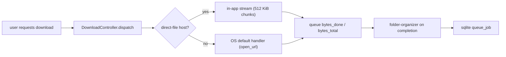
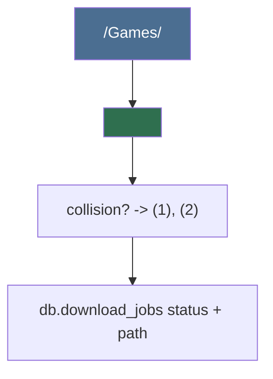

# Downloads & Folder (dm) family

## Mission

lewdzone-launcher is a desktop app whose binary also exposes a **native CLI**
that runs on **Windows, Linux, and macOS**. Download handling is host-class
dispatch: **direct-file hosts stream in-app** with live byte progress, and
every other **resolved URL** opens through the OS default handler (the
installed cloud app for that service — MEGA, Google Drive, Dropbox, OneDrive —
or the browser). There is **no download manager layer** any more, and no
configuration needed: the OS handler is zero-config.

The single hard rule: never act on anything but a **resolved, allowlisted real
URL**. The token fragment (`#t=...`) is resolved first (see `resolver`); a
streaming download must stay on its allowed host (same host or dot-boundary
subdomain) across at most 3 redirect hops; otherwise the stream is refused.

## Why host-class dispatch, not managers

- Manager detection was unreliable on real machines; the OS default handler is
  the only dependency present on every platform.
- FDM/IDM are Windows-only; `fileknot`, `pixeldrain`, `mediafire`, and
  `workupload` style direct hosts stream identically on all platforms; cloud
  pages open in the app the user already installed.
- The stream seam (`download::StreamFn` + queue progress) is faked in tests,
  keeping the suite offline and fast.
- "More" direct hosts later = one entry in `DIRECT_STREAM_HOSTS`, not a rewrite.

## Dispatch model

### Contract

- `core/download.rs`: `dispatch(job)` routes by
  `DIRECT_STREAM_HOSTS = ["fileknot", "pixeldrain", "mediafire", "workupload"]`
  (`is_direct_stream_host`); direct hosts go to `stream_target` or
  `stream_target_accelerated`; everything else to `core::native::open_url`.
- `core/download.rs` :: `stream_target` downloads via a streamable reader
  (`scraper::download_stream`) in 512 KiB chunks with a 1 MiB `BufWriter`,
  reporting `(bytes_done, bytes_total)` through the progress seam.
- `core/queue.rs`: job statuses `queued → resolving → dispatching →
  downloading → extracting → dispatched | completed | failed | cancelled`; byte
  progress is surfaced on the job.
- `scraper/fetch.rs` :: `download_stream` follows redirects manually (≤3 hops,
  same-owner only) with `max_redirects(0)`, connect/header timeouts, and **no
  body-read timeout** that would abort a multi-GB stream.

## Folder organization

Every completed download is folded into the organized library
(`folder-organizer` sub-agent):

Movers: `move` (default), `copy`, `link` — user setting `mover_mode`.

## Sub-agent roster

| Sub-agent | Ownership |
| --- | --- |
| `folder-organizer` | canonical naming, moving, collision handling |

## Cross-platform responsibilities

- Paths: always `std::path::PathBuf`, never string concat
  (`core::folder` helpers).
- Config dirs: `%APPDATA%\lewdzone` (Windows) / `~/.config/lewdzone`
  (Linux) / `~/Library/Application Support/lewdzone` (macOS) — resolved by a
  single `platform` seam (`src-tauri/src/core/platform.rs`).
- OS open: `rundll32 url.dll,FileProtocolHandler` (Windows,
  `CREATE_NO_WINDOW`) / `open` (macOS) / `xdg-open` (Linux) — argv array via
  `std::process::Command`, never a shell.
- A direct stream that detours to a foreign host → `Error::Network`, fast,
  never a partial file.

## Definition of done (family level)

- `DIRECT_STREAM_HOSTS` routes direct hosts into the in-app stream and every
  other host to the OS default handler.
- Redirect hops stay same-owner and are capped at 3; violations are typed
  errors.
- Queue jobs surface live byte progress; every adapter-free path is covered by
  offline unit tests.