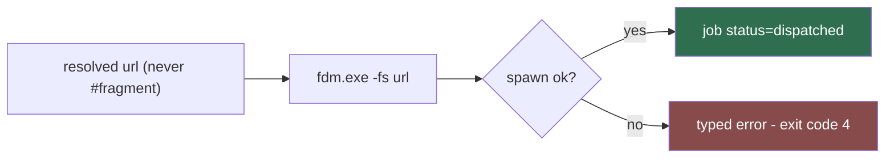

# fdm-adapter (Sub-agent of: dm)

## Boundary of responsibility

Implement the `DownloadManager` contract for Free Download Manager on Windows.
FDM is Windows-only; on Linux/macOS this adapter is simply absent from the
registry.

## Contract implementation

- `name = "fdm"`
- `platforms = ["windows"]`
- `handles_kind = "http"`
- `detect()` — see dm-detector table (default
  `C:\Program Files\Free Download Manager\fdm.exe`, x86 variant, LOCALAPPDATA
  scan, then a `settings.dm.fdm.path` override).
- `launch(url, target_dir, filename)`:

## Invocation rule

`fdm.exe -fs "<url>"` — `-fs` forces a silent add with no dialogs. Spawn via
`std::process::Command` with `CREATE_NO_WINDOW` (argv array, never a shell) and
**detach**: FDM schedules the download async; lewdzone-launcher never waits for
FDM's full lifetime.

## Contract notes

- Only ever hand FDM the **resolved real URL** (see `resolver`). A
  `https://lewdzone.com/go/#...` fragment is a redirect page, not a file.
- The resolved URL may end with a literal `\r` — strip it before launch.
- Folding into `Games/<Title>/...` is done after completion by
  `folder-organizer`; `target_dir` is still passed for FDM's own save dialog
  defaults.
- AVOID `-f` per single file where possible; exact silent variant is pinned by
  tests, not assumptions.

## Definition of done

- Unit test asserts argv == `["<path>\\fdm.exe", "-fs", url]`.
- Missing exe → typed `DmMissing` error (code 4).
- Never spawn via a shell; URL is data, not a string template.