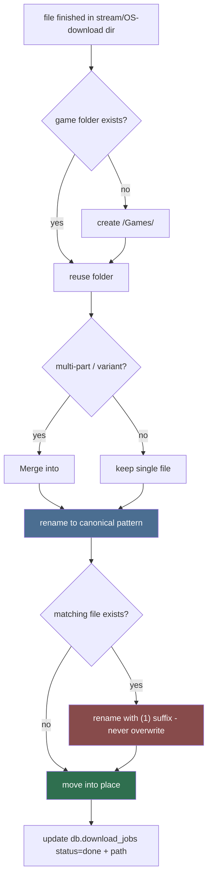

# Folder Organizer (Sub-agent of: dm)

## Boundary of responsibility

Convert finished downloads (from the in-app stream or an OS-handler download
that lands in the user's download dir) into the organized, browsable library on
disk. This is the physical mirror of the SQLite catalog. Platform-agnostic:
paths always use `std::path::PathBuf`; the root default comes from the
platform-aware settings key.

## When a download completes

## Canonical naming pattern

`<Title> - <Version> - <Platform>[- <Variant>].<ext>`

- Sanitize per `.agents/rules/rule-02-naming-conventions.md` (remove
  `\/:*?"<>|`, collapse spaces, trim dots).
- Multi-part downloads (`(Part 1 Compressed)` etc.) share one folder; each
  part keeps its part marker in the filename.

## Rules

1. NEVER overwrite an existing file; collision -> ` (1)`, ` (2)`, ...
2. File moves must be atomic where possible (same volume), else copy+delete.
3. Optionally hardlink/symlink the file into the game folder instead of moving
   if the user sets `mover_mode = copy|move|link` — default `move`.
4. If the download filename lacks version/platform (common when an OS handler
   strips it), reconstruct the name from the `DownloadJob` metadata, not by
   guessing the file content.
5. Record the final canonical path in the DB immediately after a successful
   move; a failed move must not corrupt the DB record (transaction).

## Definition of done

- A simulated completion moves a file into `Games/<Title>/` with the canonical
  name; collision scenario yields ` (1)` and never clobbers.
- Naming + sanitization are pure and heavily unit-tested (including weird
  titles like `Lust for Mars: Episode 1/2`, non-ASCII titles, and impossible-to-encode
   Windows `:` filenames on Linux/macOS).