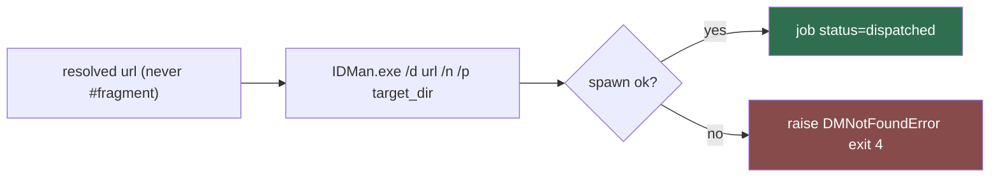

# idm-adapter (Sub-agent of: dm)

## Boundary of responsibility

Implement the `DownloadManager` contract for Internet Download Manager on
Windows. IDM is Windows-only; on Linux/macOS this adapter is absent from the
registry.

## Contract implementation

- `name = "idm"`
- `platforms = ("win32",)`
- `handles_kind = "http"`
- `detect()` — see dm-detector table (default
  `C:\Program Files (x86)\Internet Download Manager\IDMan.exe`, LOCALAPPDATA
  scan, then `settings.dm.idm.path` override).
- `launch(url, target_dir, filename)`:

## Invocation rule

`IDMan.exe /d <url> /n /p <target_dir>` — `/d` starts a download, `/n`
suppresses the confirmation dialog (silent add), `/p` sets the target folder.
Spawn via `subprocess.Popen(args, creationflags=CREATE_NO_WINDOW, shell=False)`
and detach immediately.

## Contract notes

- `/f <filename>` may be added when the canonical name differs from IDM's
  guess; tests pin the exact argv shape.
- Only ever hand IDM the **resolved real URL**, never a `#fragment` go-link.
- Strip the trailing literal `\r` from resolved URLs before launch.
- Folding into `Games/<Title>/...` is handled after completion by
  `folder-organizer`.

## Definition of done

- Unit test asserts argv == `["<path>\\IDMan.exe", "/d", url, "/n", "/p", dir]`.
- Missing exe → typed `DMNotFoundError(code=4)`.
- Never `shell=True`; URL is data, not a string template.