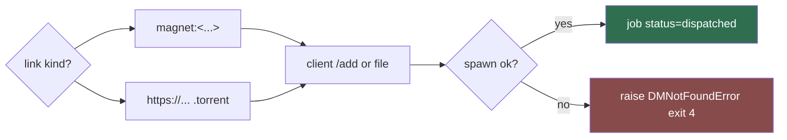

# torrent-adapter (Sub-agent of: dm)

## Boundary of responsibility

Implement the `DownloadManager` contract for torrent/magnet links. Some
lewdzone entries are distributed as `.torrent` files or magnet URIs; those must
route to a torrent client (uTorrent or BitTorrent) — never to an http manager
that would download an opaque `.torrent` blob into the game folder.

## Contract implementation

- `name = "utorrent"`
- `platforms = ("win32", "linux", "darwin")`
- `handles_kind = "torrent"`
- `detect()` — see dm-detector table (settings override → PATH:
  `uTorrent` / `ut` / `bittorrent` → well-known install dirs).
- `launch(url, target_dir, filename)`:

## Invocation rules

- Magnet: `<client> <magnet-uri>` (bare positional argument).
- `.torrent` URL: download the `.torrent` file **ourselves** into the job's
  temp dir, then hand the client the local `.torrent` path
  (`uTorrent.exe /path "C:\\...\\game.torrent"` style where supported).
- Spawn with `shell=False`; `CREATE_NO_WINDOW` on Windows,
  `start_new_session=True` on POSIX. Detach immediately.

## Contract notes

- Torrent completion is detected differently from http managers (client owns
  the data dir). Map the job to `folder-organizer` after the client reports
  the data directory; store `data_path` on the job row.
- Never pass a `#fragment` go-link to a torrent client — resolve first
  (see `resolver`).
- The torrent client must be present, else exit code 4 with an actionable
  install hint.

## Definition of done

- Magnet vs `.torrent` branching is unit-tested; argv shapes pinned.
- Test proves torrent links never reach `fdm-adapter` / `idm-adapter`.
- Missing client → typed `DMNotFoundError(code=4)`.