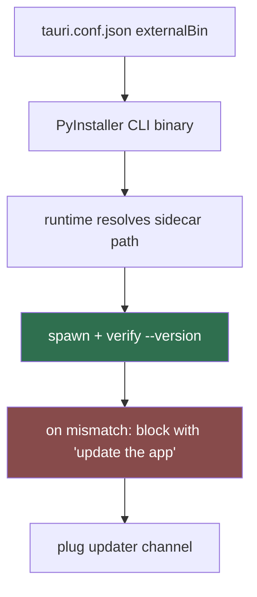

# App Shell (Sub-agent of: gui)

Owns everything the Rust binary does in the Tauri 2 app — the shell around the
webview and the CLI sidecar. Thin by design: no domain logic here.

## Responsibilities

- Main window creation, tray if added, OS-native menus, close-to-tray.
- Bundle config: `tauri.conf.json` (`bundle` block), `Cargo.toml` deps.
- Sidecar management: register the Python CLI as `externalBin`, resolve its
  path at runtime, verify version, restart on crash.
- Capability/permission model (Tauri v2 capabilities) so the webview only
  reaches the surfaces it needs.
- Signing (`signingIdentities`, WiX/NSIS), notarization (macOS), updater
  channel keys.

## Sidecar wiring

## Packaging matrix (enforced)

| Platform | Bundle | Uninstall path |
| --- | --- | --- |
| Windows | NSIS (+ optional MSI) | Programs & Features |
| macOS | .app + DMG | drag-out / Applications |
| Linux | AppImage + deb + rpm | AppImage (portable) / pkgs |

## Rules

1. Zero domain logic in Rust — data flows CLI ↔ webview as JSON.
2. Version of CLI sidecar == app version; enforced at spawn (Rule 08).
3. Never block the webview thread; commands are async, results via events or
   callback futures.
4. Bundle cryptography/keys are secrets (Rule 10): signing key and updater
   keys in CI secrets, never in-repo.

## Definition of done

- `tauri dev` boots the app and spawns the CLI sidecar in dev mode.
- CI produces all three platform artifacts with working uninstall and correct
  sidecar version pinning on a sample build.