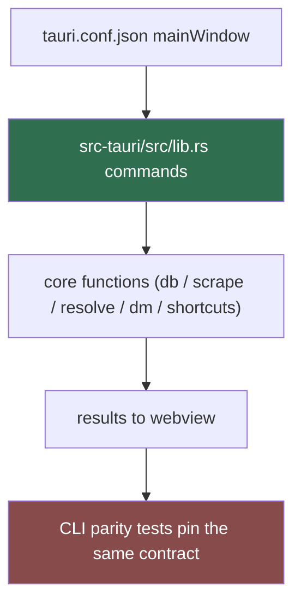

# App Shell (Sub-agent of: gui)

Owns everything the Rust binary does in the Tauri 2 app — the shell around the
webview and the shared core that both entry points use. Thin by design: no
domain logic in the webview.

## Responsibilities

- Main window creation, tray if added, OS-native menus, close-to-tray.
- Bundle config: `tauri.conf.json` (`bundle` block), `Cargo.toml` deps.
- Shared-core commands: expose `#[tauri::command]` handlers over the same
  functions the CLI calls — no subprocess management, no re-implementation.
- Capability/permission model (Tauri v2 capabilities) so the webview only
  reaches the surfaces it needs.
- Signing (`signingIdentities`, WiX/NSIS), notarization (macOS), updater
  channel keys.

## Shared-core wiring

## Packaging matrix (enforced)

| Platform | Bundle | Uninstall path |
| --- | --- | --- |
| Windows | NSIS (+ optional MSI) | Programs & Features |
| macOS | .app + DMG | drag-out / Applications |
| Linux | AppImage + deb + rpm | AppImage (portable) / pkgs |

## Rules

1. Zero domain logic in the webview — the Rust core owns it; the webview is a
   thin renderer.
2. One version for the whole binary; `lewdzone-launcher --version` reports it
   (Rule 08).
3. Never block the webview thread; commands are async, results via events or
   callback futures.
4. Bundle cryptography/keys are secrets (Rule 10): signing key and updater
   keys in CI secrets, never in-repo.

## Definition of done

- `tauri dev` boots the app; `cargo run` runs the CLI — both hit the same
  core.
- CI produces all three platform artifacts with working uninstall and a
  `--version` smoke test on a sample build.