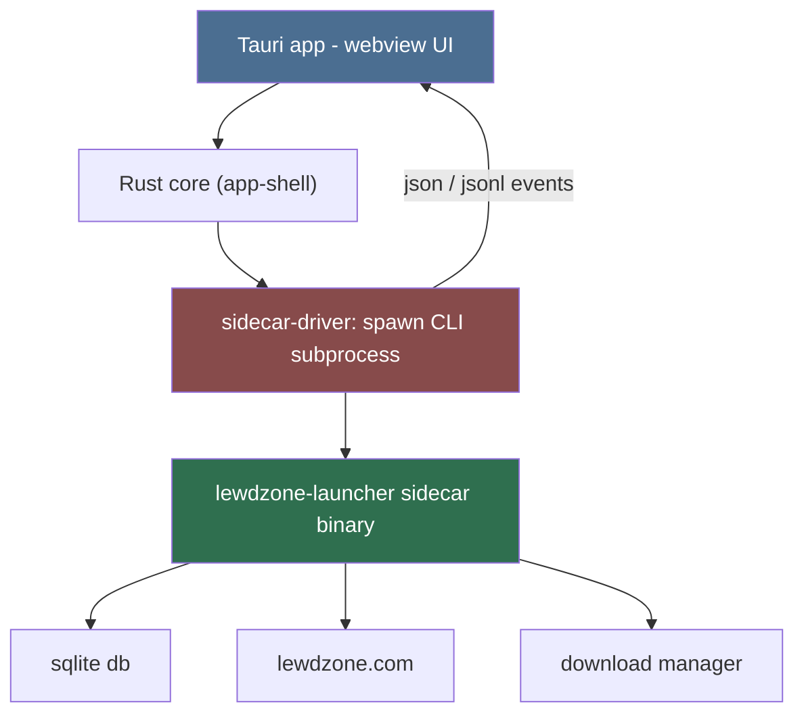
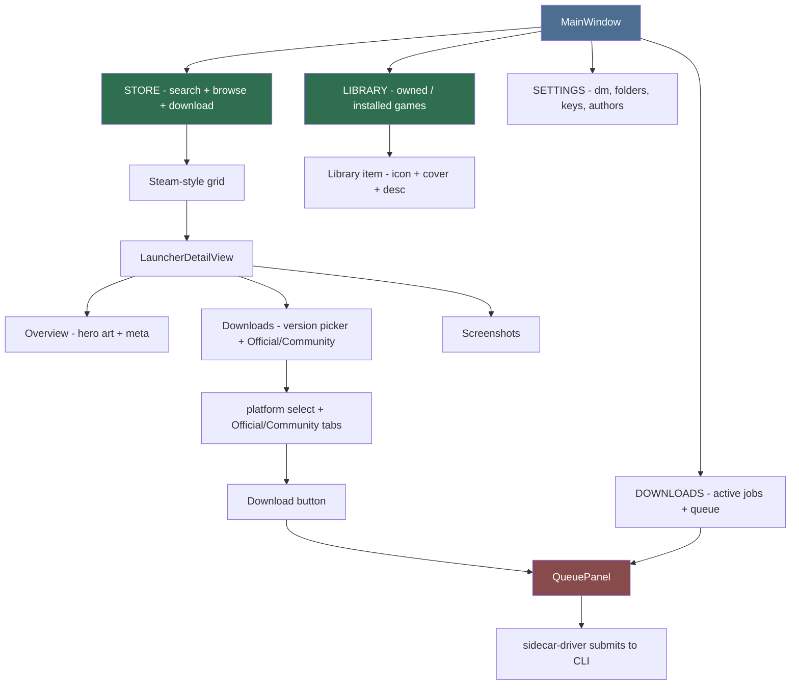
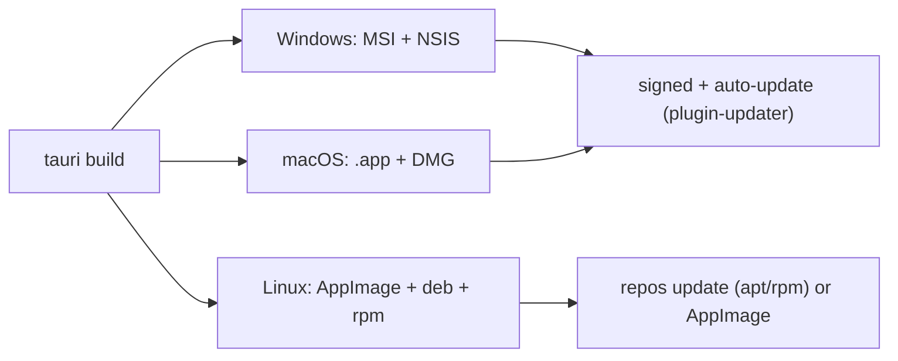

# GUI / Desktop App (Primary Agent)

The desktop app is a **Tauri 2** application (Rust core + OS webview frontend)
that ships as an **executable with a real installer/uninstaller** for Windows,
Linux, and macOS. It NEVER imports the Python package. It drives the internal
Python CLI (`lewdzone-launcher`) as a **subprocess** and parses its `--json` /
machine output. The CLI is the single source of truth (Rule 03, Rule 13).

## Runtime decision: Tauri 2

Chosen over Electron/Tk/Qt/Flutter for the stated goal of "fastest, most
efficient, cross-platform":

| Metric | Tauri 2 | Electron | Flutter |
| --- | --- | --- | --- |
| Installer size | ~5-15 MB | 80-200 MB | 30-140 MB |
| Idle RAM | ~25-60 MB | 100-250 MB | 100-180 MB |
| Cold start | ~0.2-0.5 s | 1-3 s | ~0.5-1 s |
| Windows bundling | MSI + NSIS | NSIS/Squirrel | MSIX/NSIS |
| macOS bundling | .app + DMG | DMG | .app + DMG |
| Linux bundling | AppImage + deb + rpm | AppImage/deb | AppImage/deb |
| Auto-update | `@tauri-apps/plugin-updater` | electron-updater | desktop_updater |

Web frontend uses Svelte + Vite inside the webview; the Rust core is thin and
forwards to the CLI sidecar. No embedding Python in the app — Python ships as
a **sidecar executable** (`externalBin`) the app spawns.

## Two-process machine

Every GUI action maps to exactly one CLI invocation. The Rust core only
orchestrates lifecycle, spawns/tears down the process, and fans JSON events to
the frontend. All domain logic stays in the CLI (Rule 03 inward imports).

## Protocol with the CLI

- **Query commands** (`catalog list`, `search`, `game info`): single
  `lewdzone-launcher <cmd> --json` call; parse one JSON document on stdout; exit
  code on stderr.
- **Long-running commands** (`sync`, `download`, `rebuild shortcuts`): CLI runs
  in **machine mode** emitting newline-delimited JSON events
  (`{event, progress, message, ...}`) on stdout; final result is the last
  event. App renders progress live and keeps the process cancelable (SIGTERM
  / graceful `--interrupt` flag).
- The CLI subprocess runs with a **hidden console** (Windows) or detached
  session (POSIX); all rendering is the app's job.
- Versioning: the sidecar CLI binary version must match the app version
  (Rule 08 sync across metadata files).

## Main window (Steam-like page navigation)

## Design language (from the user)

The app is a **steam-like game launcher**, not a productivity tool:

- **Steam-style grid view** for the library — clean, cover-art-driven tiles,
  eager hover metadata, right-click context menu, smooth scroll. Content comes
  **directly from the website** (via the CLI scrape pipeline), not a static
  list — the grid renders from live `catalog list --json` + grid artwork.
- **Unique custom UI** — no stock webview/widget look. Every component is
  deliberately styled; nothing looks like a default browser form.
- **Site colors** — the lewdzone.com palette defines the theme (primary/
  accent/background tokens in the design-token stylesheet) so the app feels
  native to the site while still reading as a real game launcher.
- Grid tiles use **hero/cover art** (scraped from the game page or the
  SteamGridDB pipeline) with fallback placeholder tiles when art is missing.
  Tiles show title on hover, recently-updated badge, ongoing/completed state
  chip, and platform icons.

## Component map

| Component | Responsibility | Backed by |
|---|---|---|
| Store page | Search + browse all games (Steam-style grid), entry to game detail + download | CLI `catalog list --json`, `search` |
| Library page | **Installed/downloaded games**: icon + cover art + description, launch/shortcut | CLI `download list`, `shortcuts`, artwork |
| Downloads page | Active/past jobs + queue + progress | CLI `download list --json` + event stream |
| Settings page | Download root, active DM, API keys, mover mode, theme | CLI `settings get/set` |
| GameDetailView | Launcher-style detail: hero art band, meta, versions, download table | CLI `game info <id> --json` |
| VersionPicker | Dropdown + Official/Community tabs | parsed DownloadEntries |
| QueuePanel | Active/past jobs + progress | CLI `download list --json` + event stream |
| ShortcutsView | Rebuild shortcuts per game | CLI `shortcuts rebuild` |

## Packaging & installers

- Windows: NSIS installer + optional MSI; uninstaller via OS Programs &
  Features; signing optional (`signingIdentities`).
- macOS: .app bundle + DMG; notarization for wide distribution.
- Linux: AppImage (portable) + deb/rpm (system integration + uninstall via
  package manager).
- Python CLI ships as bundled **sidecar executable** (PyInstaller) so users
  never install Python; pinned per release.

## Non-negotiables

1. GUI never imports `lewdzone_launcher` — process boundary only. GUI↔CLI parity is
   defined at the command/JSON contract level (Rule 03, parity test in Rule 11).
2. Never block the UI thread: no spawn, no parsing, no filesystem on it.
   Async via webview channels + `await` on commands.
3. Every long operation is cancelable and kills the child process cleanly.
4. Keyboard-first where cheap; Esc cancels; arrows move through cards.
5. Config dirs per platform (`%APPDATA%`, `~/.config`,
   `~/Library/Application Support`) — see
   [app-shell](app-shell/app-shell.md) + `core/platform`.

## Delegation

- `app-shell` — Tauri Rust core: windows, events, sidecar lifecycle, bundling,
  signing, updater.
- `view-designer` — web frontend views, layout, states, and the download flow.
- `sidecar-driver` — CLI spawn/teardown, JSON/JSONL protocol, process
  boundaries, cancellation, exit-code mapping.

## Deliverables

- `desktop/` package: `src-tauri/` (Rust), `src/` (Svelte frontend),
  `tauri.conf.json`, bundler + updater config.
- Skills: `gui-build-loop` (iterative frontend work), `package-desktop-app`
  (installer + sign + publish per OS).

## Definition of done

- App launches CLI sidecar, and the **Steam-style grid** lists/searches/game-info
  render cover art from real `catalog list --json` content scraped from the site.
- A `tauri build` produces Windows installer, macOS DMG, Linux AppImage/deb/rpm
  with working uninstall and clean stdout/stderr separation.
- QueuePanel streams live progress from `lewdzone-launcher download` machine mode;
  cancel records `status=interrupted` (exit code 5 mapping).
- Visual audit passes: colors match site palette via tokens, no default
  webview styling leaks, grid feels like a real game launcher.