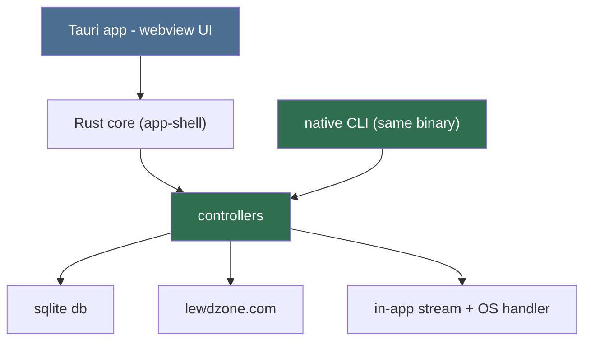
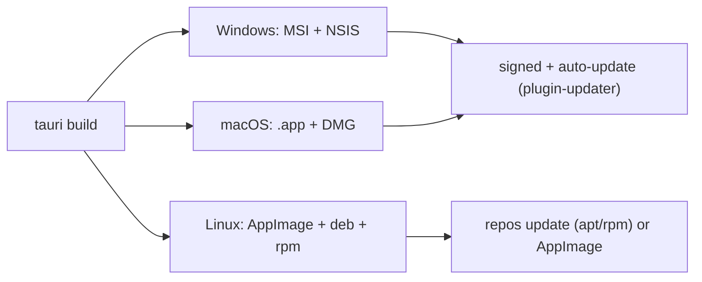

# GUI / Desktop App (Primary Agent)

The desktop app is a **Tauri 2** application (Rust core + OS webview frontend)
that ships as an **executable with a real installer/uninstaller** for Windows,
Linux, and macOS. The same binary also exposes the **native Rust CLI**
(`src-tauri/src/cli.rs`). The GUI and the CLI are two entry points into the
same Rust core: `#[tauri::command]` handlers and CLI subcommands call the same
functions — the GUI never spawns a subprocess (Rule 03, Rule 13).

## Runtime decision: Tauri 2

Chosen over Electron/Tk/Qt/Flutter for the stated goal of "fastest, most
efficient, cross-platform":

| Metric | Tauri 2 | Electron | Flutter |
| --- | --- | --- | --- |
| Installer size | ~5-15 MB | 80-200 MB | 30-140 MB |
| Idle RAM | ~25-60 MB | 100-250 MB | 100-180 MB |
| Cold start | ~0.2-0.5 s | 1-3 s | ~0.5-1 s |
| Windows bundling | MSI + NSIS | NSIS/Squirrel | MSIX/NSIS |
| macOS bundling | .app + DMG | DMG | .app + DMG |
| Linux bundling | AppImage + deb + rpm | AppImage/deb | AppImage/deb |
| Auto-update | `@tauri-apps/plugin-updater` | electron-updater | desktop_updater |

Web frontend uses Svelte + Vite inside the webview. The Rust core is the
shared module both entry points use; the webview calls `#[tauri::command]`
handlers, never a subprocess.

## One core, in-process commands

Every GUI action maps 1:1 to a CLI subcommand; both call the same Rust core
functions. The webview never parses the CLI's output stream and never touches
the site, DB, or network directly (Rule 03 inward imports).

## CLI machine contract (for scripting)

- **Query commands** (`catalog list`, `search`, `game info`): single
  `lewdzone-launcher <cmd> --json` call; one JSON document on stdout.
- **Long-running commands** (`sync`, `download`, `rebuild shortcuts`): CLI
    prints progress on **stderr**; stdout stays machine-clean and yields one
    `--json` document on completion. Cancel via SIGTERM / graceful
    `--interrupt` flag.
- stdout is the machine channel; stderr is diagnostics (never parse stderr as
  data).
- The GUI does **not** consume this stream — it calls the same core functions
  in-process and renders typed results (Rule 13). The machine contract stays
  for external scriptability and is pinned by parity tests.

## Main window (Steam-like page navigation)

## Design language (from the user)

The app is a **steam-like game launcher**, not a productivity tool:

- **Steam-style grid view** for the library — clean, cover-art-driven tiles,
  eager hover metadata, right-click context menu, smooth scroll. Content comes
**directly from the website** via the shared Rust core's scrape pipeline —
    the grid renders live catalog data + grid artwork, never a static list.
- **Unique custom UI** — no stock webview/widget look. Every component is
  deliberately styled; nothing looks like a default browser form.
- **Site colors** — the lewdzone.com palette defines the theme (primary/
  accent/background tokens in the design-token stylesheet) so the app feels
  native to the site while still reading as a real game launcher.
- Grid tiles use **hero/cover art** (scraped from the game page or the
  SteamGridDB pipeline) with fallback placeholder tiles when art is missing.
  Tiles show title on hover, recently-updated badge, ongoing/completed state
  chip, and platform icons.

## Component map

| Component | Responsibility | Backed by |
|---|---|---|
| Store page | Search + browse all games (Steam-style grid), entry to game detail + download | core `catalog list`, `search` |
| Library page | **Installed/downloaded games**: icon + cover art + description, launch/shortcut | core `list --library`, `shortcuts`, artwork |
| Downloads page | Active/past jobs + queue + progress | core `list --jobs` + progress events |
| Settings page | Download root, keys, mover mode, theme | core `settings get/set` |
| GameDetailView | Launcher-style detail: hero art band, meta, versions, download table | core `game info <id>` |
| VersionPicker | Dropdown + Official/Community tabs | parsed DownloadEntries |
| QueuePanel | Active/past jobs + progress | core `list --jobs` + progress events |
| ShortcutsView | Rebuild shortcuts per game | core `shortcuts` |

## Packaging & installers

- Windows: NSIS installer + optional MSI; uninstaller via OS Programs &
  Features; signing optional (`signingIdentities`).
- macOS: .app bundle + DMG; notarization for wide distribution.
- Linux: AppImage (portable) + deb/rpm (system integration + uninstall via
  package manager).
- The CLI is the same binary as the app (Rule 13) — no sidecar artifact ships
  and no runtime language is required.

## Non-negotiables

1. GUI and CLI call the same Rust core — there is no process boundary.
   GUI↔CLI parity is defined at the command level (Rule 03, parity test in
   Rule 11).
2. Never block the UI thread: no heavy IO on it; async via webview channels +
   `await` on commands.
3. Every long operation is cancelable cleanly.
4. Keyboard-first where cheap; Esc cancels; arrows move through cards.
5. Config dirs per platform (`%APPDATA%`, `~/.config`,
   `~/Library/Application Support`) — see
   [app-shell](app-shell/app-shell.md) + `src-tauri/src/platform.rs`.

## Delegation

- `app-shell` — Tauri Rust core: windows, events, shared-core commands,
  bundling, signing, updater.
- `view-designer` — web frontend views, layout, states, and the download flow.
- `sidecar-driver` — GUI/CLI parity bridge: command-registry coverage,
  exit-code mapping, progress adapters.

## Deliverables

- Repo root: `src-tauri/` (Rust core), `src/` (Svelte frontend),
  `tauri.conf.json`, bundler + updater config.
- Skills: `gui-build-loop` (iterative frontend work), `package-desktop-app`
  (installer + sign + publish per OS).

## Definition of done

- The **Steam-style grid** lists/searches/game-info and renders cover art from
  the shared core's catalog data scraped from the site.
- A `tauri build` produces Windows installer, macOS DMG, Linux AppImage/deb/rpm
  with working uninstall and clean stdout/stderr separation.
- QueuePanel streams live progress from the core download command; cancel
  records `status=interrupted` (exit code 5 mapping).
- Visual audit passes: colors match site palette via tokens, no default
  webview styling leaks, grid feels like a real game launcher.