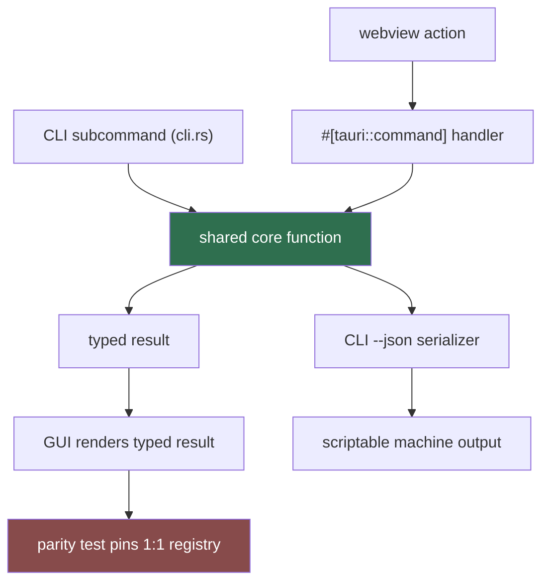

# Sidecar Driver (Sub-agent of: gui)

The name is historical: there is no sidecar process anymore (Rule 13). The GUI
and the CLI are entry points into the same Rust core. This agent owns the
**parity bridge**: guaranteeing that every GUI action maps 1:1 to a CLI
subcommand backed by the same core function, and that their contracts agree.

## Parity bridge

## Rules

1. **One core function per action.** A GUI command and its CLI subcommand call
   the same function — duplicate logic is a defect.
2. **Registry parity.** Every CLI subcommand has a `#[tauri::command]` twin
   (and vice versa); a parity test asserts the mapping.
3. **Exit-code mapping is authoritative from Rule 12:** 0 ok / 1 runtime /
   2 usage / 3 network / 4 download-manager-missing / 5 interrupted. The GUI
   maps typed errors to the same codes; errors surface in the UI error
   surface.
4. **Cancellation.** Long operations expose an async cancel path that records
   `status=interrupted` (exit code 5 mapping) — there is no child process to
   kill.
5. **`--json` is the CLI's external machine contract** (pinned
   by golden-file tests); the GUI renders typed results in-process, never by
   parsing that stream.

## Definition of done

- Every UI action has a core command with a typed result + typed error.
- A parity test asserts the GUI command registry is 1:1 with the CLI subtree.
- Interrupted jobs map to exit code 5 in DB + UI consistently.