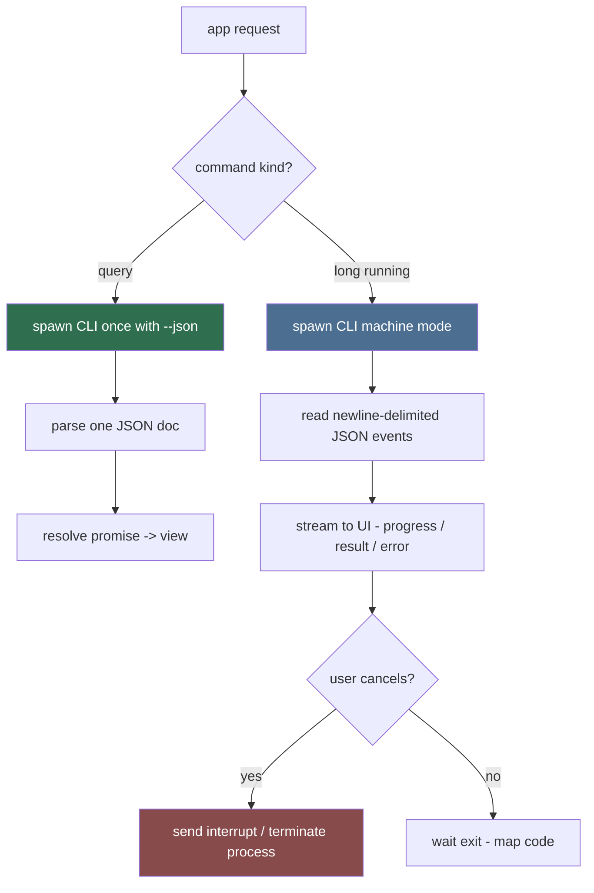

# Sidecar Driver (Sub-agent of: gui)

Owns the **process boundary**: the Tauri app talks to the Python CLI only
through this driver. It launches the CLI sidecar, feeds arguments, streams and
parses output events, and maps failures to the app's error surface.

## Spawn + protocol

## Rules

1. **One request = one CLI invocation** unless batching is explicit.
2. Child process launched with a hidden console on Windows; detached session on
   POSIX; `CREATE_NO_WINDOW` on Windows.
3. stdout is the protocol channel (JSON / JSONL); stderr is diagnostics — the
   driver never parses stderr as data.
4. Timeout per command class (network-heavy commands get longer budgets).
5. Cancellation: send the CLI's documented interrupt (SIGINT on POSIX, CTRL
   handler on Windows); if it does not exit within a grace period, `kill()`.
6. Exit-code mapping is authoritative from Rule 12: 0 ok / 1 runtime / 2 usage
   / 3 network / 4 download-manager-missing / 5 interrupted. Errors always on
   stderr, machine output on stdout.
7. Version check at first spawn: sidecar CLI `--version` must equal app version
   or the driver refuses to run (Rule 08).

## JSON contract

- Query mode: a single JSON document on stdout (schema per command in
  `cli/command-designer`), any error on stderr.
- Machine mode (sync/download/shortcuts): each line is
  `{"event": <name>, "progress": <0-100>, "message": <string>, ...}`; final
  event is the result.

## Definition of done

- Every UI action has a driver method with typed result + typed error.
- A unit test mocks a fake CLI executable that emits canned JSONL and asserts
  the driver's stream + cancellation behavior (see `testing/mock-engineer`).
- Interrupted job maps to exit code 5 in DB + UI consistently.