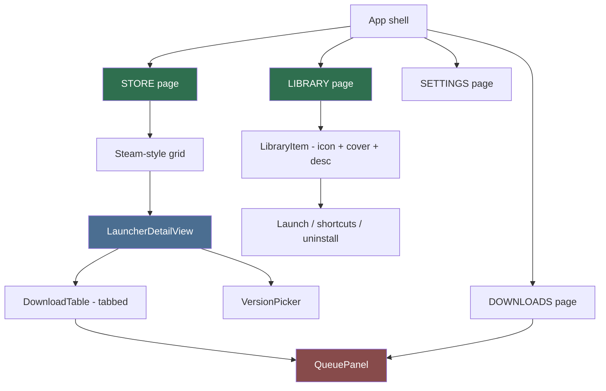
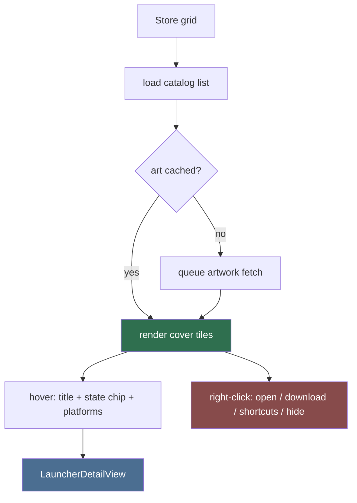
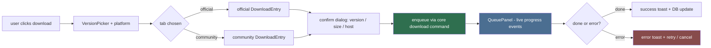
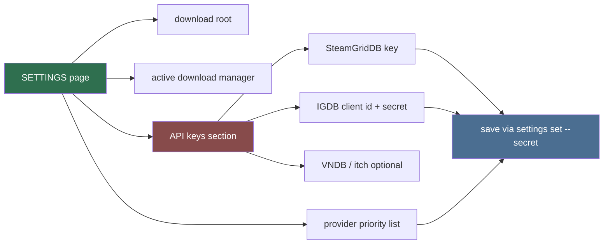

# View Designer (Sub-agent of: gui)

Owns the Svelte + Vite frontend rendered inside the Tauri webview. The app is
a **game launcher** (Steam-like grid), not a generic toolbar tool. Views are
pure presentation: they call core commands through the Tauri bridge
(`invoke()`) and emit user intents; no domain logic lives here.

## Design tokens

Theme is derived from the **lewdzone.com palette** so the app feels native to
the site:

| Token | Source | Use |
|---|---|---|
| `--lz-bg` / `--lz-surface` | site background/base | window + panels |
| `--lz-primary` | site accent | active nav, selection, buttons |
| `--lz-text` / `--lz-muted` | site text colors | typography + meta |
| `--lz-success`/`--lz-danger` | semantic mapping | state chips, toasts |
| `--lz-radius`, `--lz-gap` | consistent rhythm | cards, spacing |

Rules: every color is a token (no hex literals in components); dark-first
theme; accent follows the site's brand hue; motion is subtle and fast.

## Theme support (first-class, retained Steam feature)

**Custom skins are a core capability — the app deliberately keeps the theme
system that Steam dropped.** Valve's 2023 client removed user-installed skins;
many users remain upset about that abandonment, and this launcher explicitly
retains it.

1. **Token sources, in order:** built-in default (`src/lib/theme/default.css`)
   < user skin. An installed skin only overrides token values — components read
   tokens, never raw colors, so any skin works with every view.
2. **Skin layout** (per-OS user-accessible skins folder, ADR-0005 — one
   subfolder per theme; the built-in default is compiled in, never stored
   there). Windows: `<install dir>/skins/`. macOS: `~/Library/Application
   Support/lewdzone/skins/`. Linux: `$XDG_DATA_HOME/lewdzone/skins/`:
   - `theme.json` — manifest: `{ "name", "version", "author", "tokens" }` where
     `tokens` is a partial `{ "--lz-bg": "...", ... }` map.
   - embedded resources (images, accents) live **inside the theme folder, next
     to `theme.json`** — optional `assets/` (subfolders allowed).
   - bundled reference themes **Nord, Dracula, Material** are embedded in the
     binary, seeded into the skins folder on first run, and serve as live wiki
     examples.
3. **Settings → Appearance** has a Theme picker listing the default plus every
   installed skin (from `paths::skins_dir()`); changing skins swaps tokens
   **without an app restart** (CSS custom properties are swapped at runtime on
   `:root`).
4. **Security (Rule 10):** skins contain CSS tokens and asset files **only** —
   no script execution. The Svelte layer renders skin-provided CSS as a
   sanitized `<style>`/custom-property set; asset URLs are served through the
   Tauri asset protocol, never raw `file://`.
5. **Validation:** a malformed skin (bad JSON, non-token keys, path traversal
   in `assets/` names) fails the picker and falls back to the default; a
   checker test in the Rust suite validates skin manifests (`core::skins`).

## View tree

## State rules

1. Every view has exactly three states: `loading`, `ready`, `error` — driven
   by an async `load()` against the Tauri command bridge.
2. No local domain state that survives navigation; refetch from core commands.
3. Optimistic UI only for ephemeral mutations (toast on failure + reconcile).
4. Virtualized lists for catalog grids; image loading deferred; thumbnails
   from artwork cache.
5. Form validation mirrors CLI argument validation (single source of truth).
6. i18n-ready strings; labels pulled from a messages catalog, not hardcoded
   in components.

## Library grid (Steam-like launcher)

The app is a Steam-style launcher with **pages**: a **Store page** (search +
browse + download games), a **Library page** (all downloaded/installed games
with icon, cover art, descriptions), a **Downloads page** (queue), and a
**Settings page**.

Grid rules:

1. Tiles are cover-art-first, equal aspect ratio, virtualized for scroll
   perf, with a graceful placeholder (site-styled silhouette icon).
2. Content is **live from the site** via the scrape pipeline — the grid never
   hardcodes or static-ships a game list.
3. Grid matches Steam's density/cleanliness; a list/table view is optional but
   grid is the default launcher view.
4. State chips echo site badges: Ongoing / Completed / Update available.
5. The **Library page** renders only games present on disk (from
   `list --library`) and surfaces their icon + cover art +
   description + Launch / Rebuild shortcuts / Uninstall actions.

## Download flow UX

## Settings page

The Settings page (Svelte) lets users configure the launcher. Providers:
`download-root`, active download manager (`dm`), artwork-cache, API keys for
the content-provider layer.

Rules:

1. API keys render as password-style paste fields with an `unset` state;
   the app requests value entry and sends via
   `settings set <key> --secret <value>` — **never echoes the stored value**
   back from the CLI (Rule 10 redaction).
2. All secret fields ship with a "Clear" action that runs
   `settings unset <key>`.
3. Provider enable/priority edit writes `content_providers_enabled` and
   `content_priority` lists.
4. Save paths are per-OS config dirs (Rule 03): `%APPDATA%`, `$XDG_CONFIG_HOME`
   or `~/.config`, `~/Library/Application Support`.

## Definition of done

- All views load via core commands, never direct site/DB access.
- A polished LauncherDetailView showing version picker + official/community
   tabs + live queue progress, and a Steam-style grid in the Store page.
- Dark/light theme follows OS; keyboard navigation over the grid works.
- Settings page includes the API-keys section with set/unset flows for every
   configured content provider.