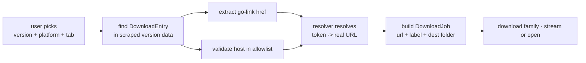

# Dispatch Builder (Sub-agent of: resolver)

## Boundary of responsibility

Bridges what the *user picked* (game, version, platform label like `Windows` /
`Android APK`, host, official/community) to the *token that must be resolved*
and then to the *download job dispatched by the download family*.

## Responsibilities

- Maintain an index from `(version_label, platform_label, tab, host)` to the
  exact go-link, so user selection is unambiguous.
- Produce a **DisplayLabel** per job (e.g. `Treasure of Nadia v1.0117 - Windows
  (Compressed)`), which the download/folder family uses for file naming.
- Handle multi-part entries (`(Part 1 Compressed)`, `(Part 2 Compressed)`):
  each part is its own download job, grouped under one game+version.
- Decode the go payload's *header fields* only via start-response meta —
  never attempt the `u` binary decode.

## Rules

- Every job is idempotent: same selection → same `DownloadJob` key.
- Never fabricate a platform; unknown labels surface as warnings, not crashes.
- Hooks into `dm/folder-organizer` only through the agreed job schema.

## Definition of done

- Picking `Treasure of Nadia v1.0177 Windows Official` yields one job whose
  resolved URL starts with an allowlisted host.
- Multi-part jobs produce N well-labeled jobs with identical parent key.