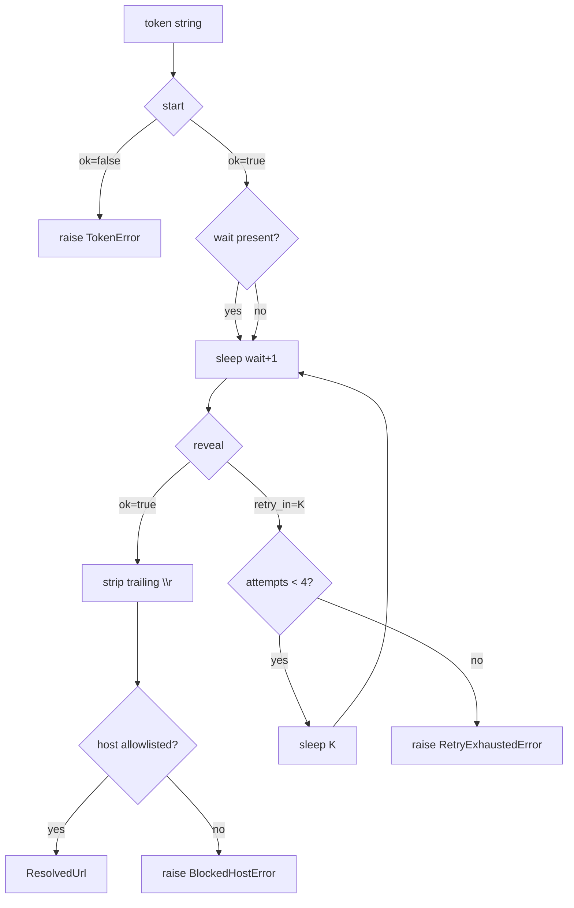

# Token Prober (Sub-agent of: resolver)

## Boundary of responsibility

The low-level correctness of the two-step api.php flow:

- Exact request/response shape for `start` and `reveal`.
- Timing: `wait` from start response, sleep `wait + 1` before reveal.
- Retry contract: `retry_in` handling, max 4 attempts (mirrors site JS).
- Trailing-`\r` stripping from the revealed URL.
- Guard rails: response must declare `ok:true`; ticket must be a non-empty
  string; host must be in the known host allowlist.

## Verified reference conversation

```json
// start
{"action":"start","token":"v1.<payload>.<sig>"}
// =>
{"ok":true,"wait":3,"own":1,"captcha":0,"ticket":"eyJ0Ijoi...","host":"fileknot",
 "platform":"windows","version":"1.0117","game":18212}

// reveal
{"action":"reveal","token":"v1.<payload>.<sig>","ticket":"eyJ0Ijoi..."}
// =>
{"ok":true,"url":"https://fileknot.io/0ddc033076217380/Treasure_of_Nadia_-_PC-v1.0117.zip\r"}
```

## Call graph



## Concurrency & politeness

- One request at a time per token; the app should serialize resolutions.
- Always send the required headers; treat the site as a shared, public
  resource (`.agents/rules/rule-05-network-etiquette.md`).
- If `captcha` ever becomes `1`, raise a clear, user-visible error — do not
  attempt auto-solving.

## Definition of done

- `start`, `reveal`, `retry_in`, trailing-`\r`, and allowlist cases all have
  unit tests using mocked responses (see `testing/mock-engineer`).
- A live smoke script (opt-in, integration-marked) resolves one real token.