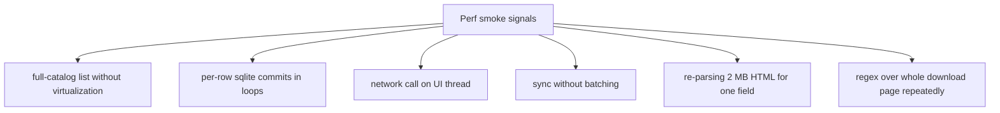

# Perf Auditor (Sub-agent of: review)

## Boundary of responsibility

Keep the app fast on big catalogs, responsive in the GUI, and polite to the
site. Focus areas: catalog scale (thousands of games), GUI list rendering,
DB query shapes, network fan-out, and download throughput side-effects.

## Perf budget (target)

| Area | Budget | Note |
|---|---|---|
| App cold start | < 2 s on reference machine | incl. DB open + first screen |
| Full catalog list | < 300 ms render (virtualized) | 5k+ games |
| Search (filtered) | < 200 ms | indexed query |
| Sync of 100 games | non-blocking; progress every 500 ms | workers, not UI |
| HTML page parse | < 400 ms/page | pure parser |
| Network fan-out | max ~1 req/s aggregate polite | see network-etiquette |
| DB write batches | one transaction per page | no per-row commit |

## Where jank comes from (watchlist)

## Checks

1. Profile hot paths with the perf harness under `src-tauri/tests/perf/`
   (criterion-style benches) plus the webview's devtools timeline for render;
   the reviewer cadence scripts a warm run of list+search.
2. SQL review in PRs: reject N+1 queries; demand indexes on
   `download_entries(game_id)`, `download_jobs(status)`, `artwork_cache(key)`.
3. Regressions measured: a micro-bench suite (`src-tauri/tests/perf/`) tagged
   `perf`, opt-in, comparing a couple of hot functions against fixed
   thresholds.
4. Fan-out guarded at the HTTP transport layer: assert per-test and in
   production code a global rate limiter exists for lewdzone.com + api.php.
5. Memory: sync must not hold all HTML pages at once; stream/parse page-by-page.

## Definition of done

- `src-tauri/tests/perf/` has smoke benchmarks; changes that blow a budget get
  flagged in review.
- Rate limiter present and unit-tested (a test proves it sleeps/spaces out
  rapid-fire calls).
- No `SELECT *`-style unbounded queries in repositories without `LIMIT`
  reasoning.