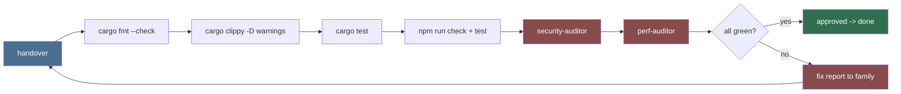

# Review (Primary Agent)

Owns the gate every milestone must pass before it counts as done: static
analysis, type safety, security review, and performance/size sanity. Review is
adversarial on purpose: it exists to catch what the implementing family missed.

## Gate pipeline (runs on every handover)

## Non-negotiables

1. The gate is the verification block in `AGENTS.md`: `cargo fmt --check`,
   `cargo clippy -- -D warnings`, `cargo check`, `cargo test`, `npm run check`
   (svelte-check), `npm run test` (Vitest). Security scan is opt-in
   (`cargo audit`, `cargo deny`).
2. Linting rules: defined by `rule-01` (Rust Code Style) — must be
   `cargo fmt --check` + `cargo clippy -- -D warnings` clean.
3. Type checks: `cargo check` on the whole crate; no masked results at
   boundaries.
4. No `#[allow(...)]` / `unsafe` without a documented reason string (Rule 10).
5. Tests run headless; live (network) tests are `#[ignore]`-tagged and skipped
   in the default gate.

## Delegation

- `security-auditor` — threat model, path traversal, SSRF/URL validation,
  secret handling, dependency audit.
- `perf-auditor` — big-collection behavior, GUI jank paths, DB query checks,
  network fan-out limits.

## Deliverables

- CI wiring running the verification block (cargo + Svelte) with coverage via
  `cargo llvm-cov`.
- A `review-checklist.md` (`.agents/agents/review/`) that every family consults pre-handover.
- Escalation policy: fixing a gate failure is the owning family's job; review
  documents what failed and why.