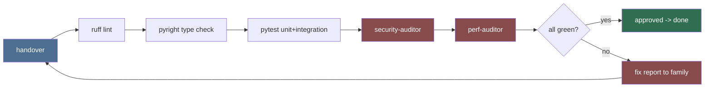

# Review (Primary Agent)

Owns the gate every milestone must pass before it counts as done: static
analysis, type safety, security review, and performance/size sanity. Review is
adversarial on purpose: it exists to catch what the implementing family missed.

## Gate pipeline (runs on every handover)

## Non-negotiables

1. The gate is fully scriptable: `lewdzone-launcher self-check` runs lint + type +
   tests + (opt-in) security scan in one command.
2. Linting rules: defined by `code-style-python.md`; must be `ruff check`
   clean (catching unused imports, undefined names, mutable defaults).
3. Type checks: `pyright` strict for `core/`, `db/`, `resolver/`, `cli/`;
   standard for the rest.
4. No `# type: ignore` without a documented reason string.
5. Tests run headless; GUI tests and live tests are marked and skipped in the
   default gate.

## Delegation

- `security-auditor` — threat model, path traversal, SSRF/URL validation,
  secret handling, dependency audit.
- `perf-auditor` — big-collection behavior, GUI jank paths, DB query checks,
  network fan-out limits.

## Deliverables

- `self-check` command + CI wiring.
- A `docs/review-checklist.md` that every family consults pre-handover.
- Escalation policy: fixing a gate failure is the owning family's job; review
  documents what failed and why.