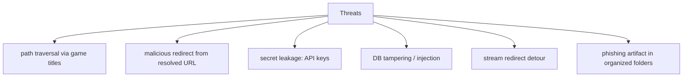

# Security Auditor (Sub-agent of: review)

## Boundary of responsibility

Review the tool as an attacker would: this app downloads third-party files and
membership-gated content, so the review focuses on harmless, privacy-respecting
and tamper-resistant behavior.

## Threat model

## Checks (each a concrete rule)

1. **Path traversal**: every game title / filename used to build a path MUST go
   through the sanitizer in `rule-02-naming-conventions.md`. Forbid `../`, absolute
   paths, reserved names (CON, PRN...), trailing dots/spaces. Golden test with
   `..\evil`-style titles.
2. **URL validation**: resolved URLs must:
   -    come back with a host in the allowlist (go.js ICONS slug set);
   - be `http`/`https` only.
   Redirects during an in-app stream must re-validate the scheme + host and
   stay on the same owner (host or dot-boundary subdomain). Malformed/truncated
   URLs (trailing `\r`) are stripped, checked, then passed.
3. **Secrets**: SteamGridDB/IGDB API keys — stored only in the SQLite `secret`
   table, never in the JSON config, never logged, never in fixtures, never in
   `--json` output, never in `--debug` logs.
4. **DB hardening**: parameterized SQL everywhere (no string-built queries);
   the DB is a local file with host-based ACL; treat downloaded content as
   hostile — validate paths, never execute a downloaded file except through the
   explicit Launch action on a user-selected executable candidate.
5. **Launch / open**: OS-handler URLs are opened via `std::process::Command`
   with a fixed argv (no shell) on Windows (`rundll32 url.dll,FileProtocolHandler
   <URL>` + `CREATE_NO_WINDOW`), macOS (`open <URL>`), and Linux (`xdg-open
   <URL>`). Explicit game launches use the user-overridable `launch_exe` from
   `app.json` or the first auto-detected candidate; the path is validated to
   exist inside the install folder.
6. **Artifact hygiene**: warn before saving emails/password-style content if
   the game page suggests a "password" field — this is normal for the genre,
   but the tool may offer to store it via keyring, not plaintext.

## Tooling

- `cargo audit` vulnerabilities gate for the dependency set.
- `cargo deny` (licenses, duplicate/suspicious deps) wired into the gate.
- Manual review checklist maintained in `review-checklist.md`
  (`.agents/agents/review/`).

## Definition of done

- All five check areas have regression tests (traversal, allowlist, secret
  redaction, DB injection, launch/open argv safety).
- `cargo audit` + `cargo deny` clean for the pinned lockfile.
- No secrets in fixtures or tests (a grep-guard enforces this).