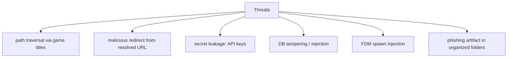

# Security Auditor (Sub-agent of: review)

## Boundary of responsibility

Review the tool as an attacker would: this app downloads third-party files and
membership-gated content, so the review focuses on harmless, privacy-respecting
and tamper-resistant behavior.

## Threat model

## Checks (each a concrete rule)

1. **Path traversal**: every game title / filename used to build a path MUST go
   through the sanitizer in `naming-conventions.md`. Forbid `../`, absolute
   paths, reserved names (CON, PRN...), trailing dots/spaces. Golden test with
   `..\evil`-style titles.
2. **URL validation**: resolved URLs must:
   - come back with a host in the allowlist (go.js ICONS slug set);
   - be `http`/`https` only (magnet/torrent only for explicitly chosen links).
   Redirects from resolved URLs must re-validate the scheme + host before any
   FDM spawn. Malformed/truncated URLs (trailing `\r`) are stripped, checked,
   then passed.
3. **Secrets**: SteamGridDB API key, any cookies — stored only in the settings
   table (or environment), never logged, never in fixtures, never in `--json`
   output, never in `--debug` logs.
4. **DB hardening**: parameterized SQL everywhere (no f-strings); the DB is a
   local file with host-based ACL; treat downloaded content as hostile — never
   execute, never auto-open archives.
5. **FDM spawn**: argv list only, `shell=False`, `-fs` only; URL is a single
   positional argument (no option injection).
6. **Artifact hygiene**: warn before saving emails/password-style content if
   the game page suggests a "password" field — this is normal for the genre,
   but the tool may offer to store it via keyring, not plaintext.

## Tooling

- `pip-audit` / `pip` vulnerabilities gate for the dependency set.
- `bandit` scan (Python) wired into `self-check`.
- Manual review checklist maintained in `docs/review-checklist.md`.

## Definition of done

- All five check areas have regression tests (traversal, allowlist, secret
  redaction, DB injection, FDM argv safety).
- `bandit` + `pip-audit` clean for the pinned lockfile.
- No secrets in fixtures or tests (a grep-guard enforces this).