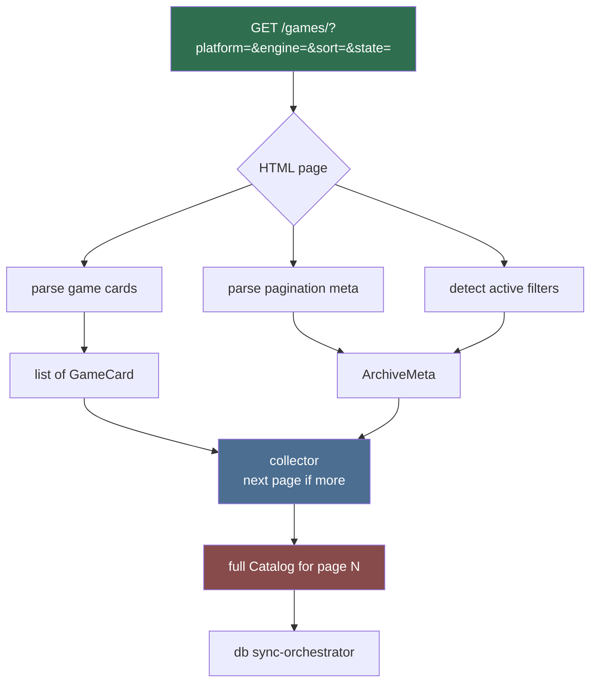

# Archive Scraper (Sub-agent of: scraper)

## Boundary of responsibility

- Parse `https://lewdzone.com/games/` result listings (game cards) and
  `https://lewdzone.com/game-genre/<slug>/` listings.
- Handle pagination. CAUTION: not yet verified whether archive pagination is
  `?page=N` or `/page/N/`. Must be discovered empirically (see
  `.agents/skills/site-verification.md`) before relying on it.
- Emit `GameCard` list + `ArchiveMeta` (current page, total pages, applied
  filters).

## Models (coordinate with database/schema-designer for authoritative shape)

The canonical models are Rust structs owned by `database/schema-designer`
(`src-tauri/src/db/`):

- `GameCard { slug, title, post_id: Option<i64>, thumb_url: Option<String>,
  platforms: Vec<String> (normalized: pc, android, linux, mac),
  engine: Option<String>, short_meta: Option<String>,
  is_ongoing: Option<bool> }`
- `ArchiveMeta { page: u32, total_pages: Option<u32>,
  applied: HashMap<String, String> }` — e.g. `{platform: "pc", sort: "popularity"}`

## Archive parse flow

## Rules

- Never follow into each game page from the archive parser; that is
  `game-page-scraper`'s job.
- URLs extracted must be absolute (resolve relative hrefs against the fetch
  base URL).
- Normalize platform/engine/sort keys to lower-case canonical slugs.

## Definition of done

- Parser consumed fixture `lz_archive.html` (saved at
  `C:\Users\Joshu\AppData\Local\Temp\opencode\lz_archive.html`) and produced
  the full known game list with zero misses on a spot-check of 10 titles.
- Pagination discovery documented in this doc (`archive-scraper.md`).