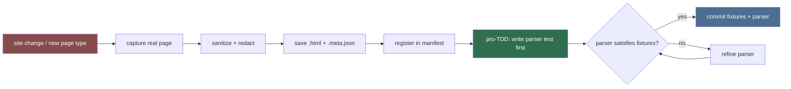

# Fixture Engineer (Sub-agent of: scraper)

## Boundary of responsibility

Curates the saved-HTML fixtures that let the whole scraper family test without
hitting the live site:

- Capture real pages to `src-tauri/tests/fixtures/html/`.
- Sanitize fixtures (strip session-specific noise) — do NOT leak personal
  data or tokens.
- Keep a manifest mapping each fixture to its source URL + capture date.
- Extend fixtures when the site changes so parse regressions are caught.

## Existing reference captures (temp scratch dir)

| Fixture | Source | Notes |
|---|---|---|
| `lz_game.html` | https://lewdzone.com/game/treasure-of-nadia/ | 47 go-links; full detail page |
| `lz_archive.html` | https://lewdzone.com/games/ (Popularity sort) | 189,386 B; archive listing |
| `lz_go.js` / `lz_go.html` | https://lewdzone.com/go/ + assets | resolution page (go links) |

These live in `C:\Users\Joshu\AppData\Local\Temp\opencode\`. Copy them into
`src-tauri/tests/fixtures/html/` as the initial corpus.

## Fixture lifecycle

## Rules

1. Fixtures are static `.html` files; never regenerated at test time.
2. Each fixture has a sibling `.meta.json`: `{source_url, captured_at, notes}`.
3. Redact anything that looks user-specific (paths, ip tokens). Download-token
   strings (`t=v1.*`) are fine inside fixtures — they are site content, but
   tests must treat them as opaque strings.
4. Add a fixture BEFORE writing a new parser section so parsing is
   fixture-first, TDD-style.

## Definition of done

- `src-tauri/tests/fixtures/html/` populated with the three reference captures + meta.
- A README in the fixtures dir explains how to re-capture a fixture from the
  live site (with the polite-download rules of `.agents/rules/rule-05-network-etiquette.md`).