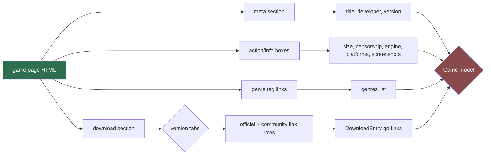

# Game Page Scraper (Sub-agent of: scraper)

## Boundary of responsibility

Parses a single `https://lewdzone.com/game/<slug>/` page into the full `Game`
model, including the download section with versions and go-links.

## Canonical Game model (bird's-eye; authority: database/schema-designer)

```python
@dataclass
class Game:
    slug: str
    post_id: int          # WP post id (-- stable identity)
    title: str
    developer: str | None
    current_version: str | None
    engine: str | None           # Ren'Py / RPGM / Unity / HTML / Others
    platforms: list[str]         # windows, android, mac, linux
    genres: list[str]            # tag slugs e.g. incest, 3dcg, harem
    size_bytes: int | None       # parsed from e.g. '7.51 GB'
    censorship: str | None       # 'Uncensored' etc.
    screenshots: list[str]
    description: str | None
    versions: list[Version]      # see below
```

```python
@dataclass
class DownloadEntry:
    label: str            # e.g. 'Windows', 'Android APK', 'Linux'
    variant: str | None   # '(Compressed)', '(Part 1 Compressed)', '(Incest Patch)'...
    host: str             # host slug from d-<host> / go payload 'h'
    go_link: str          # full https://lewdzone.com/go/#t=v1... href
```

`Version` = `{label, is_latest, download_tabs: {official: [DownloadEntry], community: [DownloadEntry]}}`.

## Parse map (game page -> models)



## Site-specific parse guidance (verified)

- Size strings like `7.51 GB`, `1.2 GB`, `850 MB` -> normalize via shared
  `parse_size()` helper.
- Download rows: platform label + optional `(Variant)` suffix; opposite hosts
  are paired in adjacent columns — distinguish Official vs Community by their
  parent tab, not by position.
- Version dropdown: `Choose Version` -> `vX.Y.Z (Latest)` marker for latest.
- Genres/tags: anchor hrefs to `/game-genre/<slug>/` — the slug is the tag id.
- `fixture-engineer` holds `lz_game.html` (treasure-of-nadia, 47 go-links) as
  the reference fixture; it must parse to 47 DownloadEntry objects.

## Rules

- 100% pure function: (html, base_url) -> Game. No requests.
- Every scraped attribute used downstream must be present in the fixture test.
- Never invent data; absent sections yield `None`/`[]`.

## Definition of done

- Fixture `lz_game.html` parses to Game with post_id 18212
  (`treasure-of-nadia`), title 'Treasure of Nadia', developer 'NLT Media',
  47 download entries, size 7.51 GB.
- Field map documented in `docs/parsing/game-page.md`.