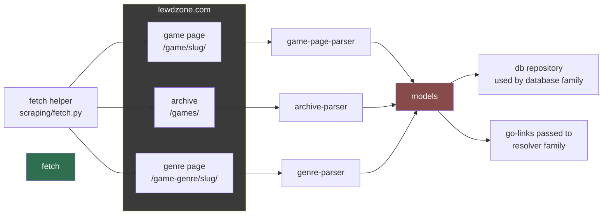

# Scraper (Primary Agent)

Owns *reading* the site: the games archive, genre listings, and individual game
pages. The scraper family converts raw HTML into clean, typed Python data
structures. It does NOT resolve download URLs (that is the resolver's job) and
does NOT persist anything (that is the database's job).

## Mission

Produce a stable parsing layer that survives WordPress theme changes, is
testable against saved HTML fixtures, and emits one canonical schema.

## Key site facts (verified)

- Base: `https://lewdzone.com`
- Game page: `https://lewdzone.com/game/<slug>/` (e.g. `/game/treasure-of-nadia/`)
- Archive: `https://lewdzone.com/games/` with filters
  `?platform=PC|Android|Linux|Mac`, `?engine=RenPy|RPG+Maker|Unity|...`,
  `?sort=Popularity|New+to+Old|...`, `?state=Ongoing|...`
- Genre archive: `https://lewdzone.com/game-genre/<slug>/`
- Game post IDs are WordPress post IDs; `https://lewdzone.com/?p=<id>` 301s to
  the permalink. Useful for stable identity.
- Download links live on the game page:
  `<a class="downloadLink d-<host>" href="https://lewdzone.com/go/#t=v1.<payload>.<sig>">`
  in tabs "Official Links" / "Community Links", grouped per version.

## Guidelines (non-negotiable)

1. NEVER parse with regex where a real parser works — prefer an HTML parser.
   Choose a single parser lib and declare it in `.agents/rules/code-style.md`
   (stdlib `html.parser` is acceptable; a third-party lib must be justified).
2. Every parser takes `(html: str) -> Model` and is 100% pure (no network).
   Network fetching lives in a thin fetch helper (`scraping/fetch.py`).
3. Every parse result uses the canonical models (Game, Genre, Version,
   DownloadEntry, GameCard) defined by `database/schema-designer`.
4. Structural unknowns (nil fields) must be `Optional` — never crash on missing
   sections.
5. Parsers are built against saved fixtures FIRST (see `fixture-engineer`), so
   tests never hit the live site. Live site verification happens only via the
   `site-alpha-test` exercise defined by `testing/mock-engineer`.

## Scraper pipeline (how HTML becomes typed models)

## Deliverables

- `scraping/` package: fetch helper + parsers + canonical models import.
- Markdown "parse map" per page type (where each field lives in the HTML),
  kept in `docs/parsing/`.

## Definition of done

- Parser round-trips: real fixture HTML -> model -> all required fields populated.
- No parser makes a network call; network tests are integration-marked.
- Archive + game-page + genre parsing all covered by unit tests using fixtures.