# Artwork Fetch (Sub-agent of: shortcuts)

## Boundary of responsibility

Everything about getting image assets from SteamGridDB and making them usable
as Windows shortcut icons.

## Workflow

```mermaid
flowchart TD
    A[game title + platform] --> B{artwork cached?}
    B -- yes --> C[reuse cached artwork id]
    B -- no --> D[search autocomplete by title]
    D --> E{clean match?}
    E -- yes --> F[GET icons/game/&#123;id&#125;]
    E -- no / ambiguous --> G[score candidates; pick best]
    F --> H[pick icon by style + size pref]
    G --> F
    H --> I[download image]
    I --> J[convert to .ico<br/>256px fallback]
    J --> K[store in artwork cache dir]
    K --> L[return .ico path]
    L --> M[shortcut-builder uses path]

    style A fill:#2f6f4f,color:#fff
    style J fill:#874b4b,color:#fff
    style L fill:#4b6e91,color:#fff
```

## API details (must implement)

- Auth header `Authorization: Bearer <key>`; key from settings/config.
- Search: `GET https://www.steamgriddb.com/api/v2/search/autocomplete/{url-quoted title}`
- Icons: `GET https://www.steamgriddb.com/api/v2/icons/game/{id}`
  - Pick by `mime` (prefer png), reasonable `width/height`, and style if the
    response includes style info.
- NSFW: lewdzone titles may be flagged; set the `nsfw` query param
  (`?nsfw=yes`) so mature art is still returned, and cache the choice.
- Handle 404/no-data: produce `None` and let caller fall back to generic icon.

## Icon conversion

- Use Pillow (declare dependency in `pyproject.toml` under a
  `[artwork]` extra) to write a 256x256 `.ico` containing 16/32/48/256 sizes.
- Prefer SteamGridDB icons with square-ish aspect; for grids/heroes, do NOT
  use them as `.lnk` icons (wrong aspect) — those are only for Steam-library
  display, not shortcut icons.

## Rules

- Always download fresh art into the project's `artwork_cache/` dir; never
  write into the game's install folder.
- Cache responses: an artwork lookup keyed by `(normalized_title, platform)`
  stored in DB table `artwork_cache` so repeated rebuilds are offline-fast.
- Do not log API keys or full Authorization headers.

## Definition of done

- `fetch_icon(title, platform) -> Path | None` returns a valid `.ico` for
  "Treasure of Nadia", and `None` (no crash) for an unknown title.
- All network calls mocked in unit tests; one opt-in integration test against
  the real API with a user-supplied key.