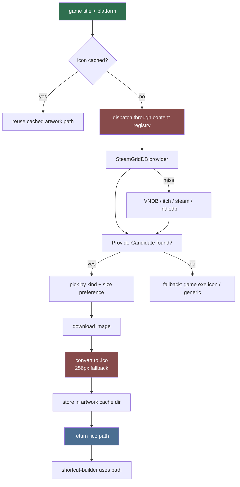

# Artwork Fetch (Sub-agent of: shortcuts)

## Boundary of responsibility

Everything about getting image assets **through the content-provider layer**
(`.agents/agents/content/`) and making them usable as native shortcut icons.
This agent is a consumer of `services/content/` providers — it never talks to
a provider API directly.

## Workflow

## Provider details (owned by content layer)

- Preferred icon source is the SteamGridDB provider (Bearer key from settings).
- `nsfw=yes` for mature lewdzone titles so art is still returned; cache the
  choice.
- Handle 404/no-data: produce `None` and let caller fall back to the game
  exe's embedded icon or a generic icon.
- Candidate quality is scored by the content registry
  (`provider-registry`); ambiguity falls through to the next provider.

## Icon conversion

- Use Pillow (declare dependency in `pyproject.toml` under a
  `[artwork]` extra) to write a 256x256 `.ico` containing 16/32/48/256 sizes.
- For grids/heroes/covers, do NOT use them as shortcut icons (wrong aspect) —
  those are for Library/app display only.

## Rules

- Always download fresh art into the project's `artwork_cache/` dir; never
  write into the game's install folder.
- Cache responses: an artwork lookup keyed by `(normalized_title, platform)`
  stored in DB table `artwork_cache` (with `provider` + `kind` columns) so
  repeated rebuilds are offline-fast.
- Do not log API keys or full Authorization headers.

## Definition of done

- `fetch_icon(title, platform) -> Path | None` returns a valid `.ico` for
  "Treasure of Nadia" (via content registry), and `None` (no crash) for an
  unknown title.
- All network calls mocked in unit tests; one opt-in integration test against
  a real provider with a user-supplied key.