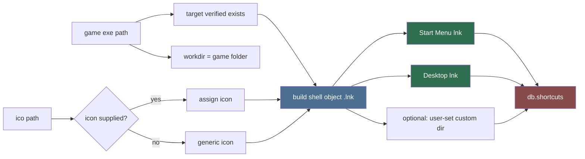
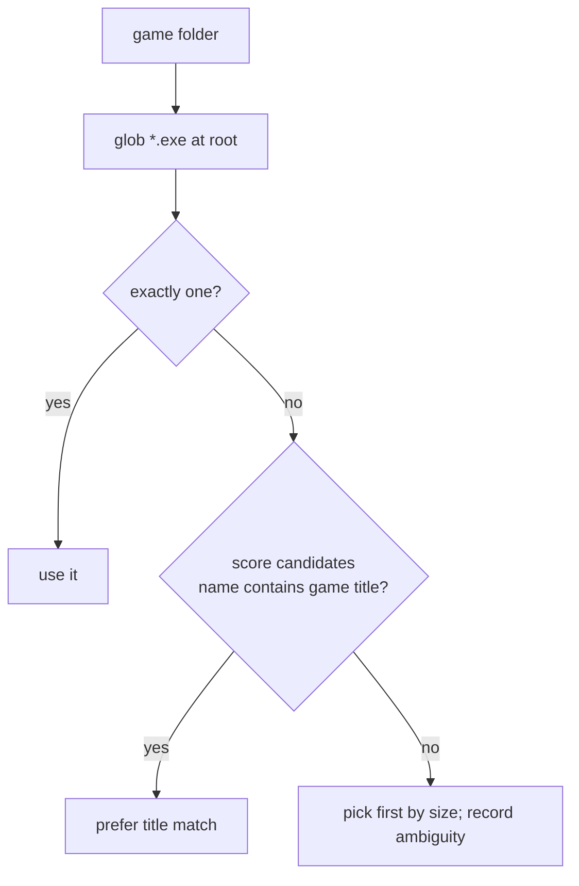

# Shortcut Builder (Sub-agent of: shortcuts)

## Boundary of responsibility

Take an organized game folder + an optional `.ico` and produce working Windows
shortcuts. This is the ONLY agent allowed to manipulate `.lnk` files.

## Where shortcuts go

## Implementation notes (Windows, winwz)

- Use the WScript Shell COM interface (`win32com.client.Dispatch("WScript.Shell")`)
  or the packaged `windows shortcut API`; python env must have `pywin32`.
- `shell.CreateShortcut(path)` -> set `TargetPath`, `WorkingDirectory`,
  `Arguments`, `IconLocation`, `Description`, then `.Save()`.
- Start Menu root:
  `%APPDATA%\Microsoft\Windows\Start Menu\Programs\<lewdzone>/<Title>.lnk`
  (create `lewdzone` subfolder by default).
- Desktop root: `%USERPROFILE%\Desktop`.
- Game names may contain characters invalid in filenames — sanitize per
  `.agents/rules/naming-conventions.md` (strip `/<>\|:*?"`).

## Primary-exe detection

## Rules

1. Verify `TargetPath` exists at build time; if missing, record a
   `pending-repair` row and still write the `.lnk` (so the user sees what's
   broken).
2. Rebuild = delete existing `.lnk` for the same slot then recreate — never
   duplicate.
3. A `.lnk` whose target moved must be rebuildable from `db.shortcuts` stored
   fields; store `exe_path`, `folder`, `display_name`, `icon_path` at build.
4. If the icon is `None`, use the base game exe's embedded icon if it exists,
   else a generic shell icon.

## Definition of done

- `create_shortcuts(build: ShortcutSpec) -> list[Path]` creates Start Menu +
  Desktop links; second run produces identical results (idempotent).
- Broken-target path covered by unit test (nonexistent exe still yields a
  `.lnk` + repair row).
- Windows-only module; guarded import so non-Windows test runs skip it.