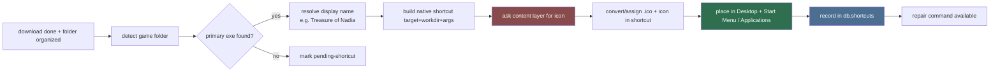

# Shortcuts (Primary Agent)

Owns the "make your downloads feel like real games" layer: after FDM finishes
a download and the folder-organizer archives it, this family creates a
double-clickable Windows shortcut (`.lnk`) in the Start Menu and/or Desktop,
gives it a proper icon from **SteamGridDB**, and keeps the whole thing
re-runnable.

## Mission

Turn a raw downloaded folder into a polished shortcut:

1. Detect the primary executable in the game folder.
2. Build a native shortcut (Desktop + Start Menu / Applications) with correct
   target/workdir.
3. Pull artwork/icons from the **content-provider layer**
   (`.agents/agents/content/`) — SteamGridDB + VNDB + itch + others — and
   assign them to the shortcut.
4. Record everything in the DB so shortcuts can be repaired/rebuilt after a
   game update or folder move.

## Shortcut + artwork pipeline

## External tools (evaluated)

| Tool | What it does | Fit |
|---|---|---|
| **SteamGridDB API v2** | Free API; search games + download grids/icons/heroes/logos | Primary icon source via the content layer (auth: Bearer API key) |
| **SGDBoop** | SteamGridDB official app; "BOOP" buttons apply art directly into Steam library | Good for Steam users; not needed for plain shortcuts |
| **Steam ROM Manager (SRM)** | Bulk-imports titles + artwork into Steam | Overkill for native shortcuts; Steam-only |
| Steam Commander (if it exists in your setup) | Verify behavior empirically before relying | Optional; prefer the API path |

Icons come from the **content-provider layer** (SteamGridDB first, then VNDB /
itch / Steam / IndieDB), not from a single hard-wired client. SGDBoop/SRM are
forwarded to when the user also wants the game in their *Steam* library.

## SteamGridDB API reference (verified shape)

(Below is the SteamGridDB-specific surface used by the `content` layer's
`steamgriddb-provider`; see `.agents/agents/content/` for the full provider
registry and the other providers.)

- Base: `https://www.steamgriddb.com/api/v2`
- Auth: `Authorization: Bearer <API_KEY>` (free key at
  `https://www.steamgriddb.com/profile/preferences`)
- Search: `GET /api/v2/search/autocomplete/{q}` -> `{success, data:[{id,name,types,...}]}`
- Icons: `GET /api/v2/icons/game/{game_id}` -> `{success, data:[{id,url,width,height,thumb,mime,...}]}`
- Grids (capsules): `GET /api/v2/grids/game/{game_id}?dimensions=600x900`
- Heroes: `GET /api/v2/heroes/game/{game_id}`
- Logos (transparent): `GET /api/v2/logos/game/{game_id}`
- Rate limit: polite quota; treat as public resource (see
  `.agents/rules/network-etiquette.md`).

## Delegation

- `artwork-fetch` — icon/cover resolution for shortcuts **via the content
  layer**, style/size selection, `.ico` generation, and the DB-backed cache of
  `game -> artwork id`.
- `shortcut-builder` — native shortcut creation per OS (`.lnk` via
  `win32com` on Windows, `.desktop` on Linux, `.app`/aliases on macOS),
  folder->exe resolution, start-menu/app placement, idempotent rebuilds.

## Non-negotiables

1. Shortcuts are always created for games the user actually downloaded (folder
   must exist). Never fabricate a shortcut for a not-downloaded game.
2. `.lnk` targets must be verified to exist at build time; stale shortcuts get
   a repair path, not a silent skip.
3. Artwork downloads reuse the network-etiquette rules; failures degrade
   gracefully (shortcut still created, icon falls back to generic).
4. API key is read from config/settings — never hardcoded or logged
   (`.agents/rules/security.md`).

## Deliverables

- `shortcuts/` package: `ShortcutBuilder`, `IcoConverter`, and a thin
  `ArtworkClient` that dispatches through `services/content/` providers.
- DB tables via `database/schema-designer`: `shortcuts`, `artwork_cache`
  (with `provider` + `kind` columns).
- Skill: `grab-steamgriddb-artwork` (see `.agents/skills/`) + the
  content-layer skill `enrich-game-and-art`.

## Definition of done

- End-to-end: download a game -> shortcut appears on Desktop + Start Menu with
  a real icon resolved from the content layer (SteamGridDB or fallback).
- Rebuild is idempotent (running repair twice produces identical shortcuts).
- No network call in unit tests (all artwork/client calls mocked).