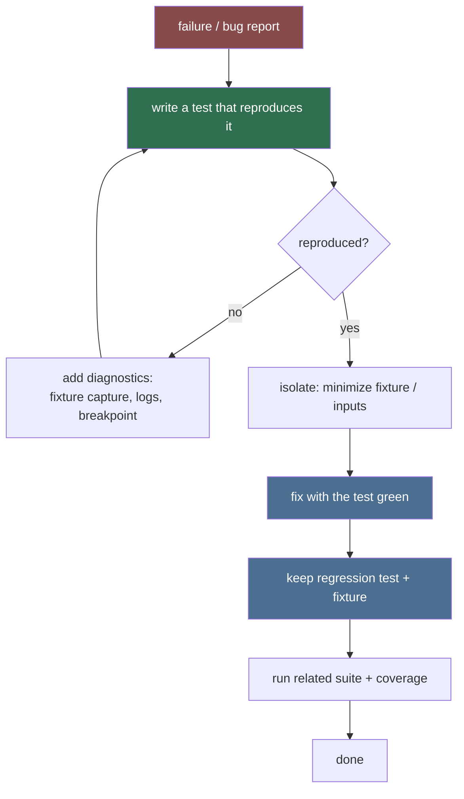

# Debugger (Sub-agent of: testing)

## Boundary of responsibility

Make failures easy to reproduce, isolate, and root-cause during development:
reliable breakpoints, recorded inputs, fault injection harnesses, and a
structured postmortem routine. Works hand-in-hand with the
`test-suite-architect` so the *suite itself* exposes intractable bugs.

## Debug loop



## Tools & techniques (documented in repo)

1. **Fixture capture recorder**: a pytest fixture that records real calls
   (HTTP request/response, FDM argv, SteamGridDB lookups) into
   `tests/fixtures/` when `--record` is passed, then replays offline. This is
   how new fixtures are born from live bugs.
2. **Fault injection**: a `seeds` tool to make api.php or FDM fail
   deterministically (retry_in, bad ticket, truncated url, host not in
   allowlist) so error paths are testable.
3. **Breakpoint ergonomics**: recommend `pdb`/`ipdb` usage, `--pdb`,
   `PYTHONBREAKPOINT=ipdb.set_trace` guidance, and logging hooks
   (`--log-cli-level`).
4. **Fake fdm.exe / fake site server**: standalone scripts in
   `tests/support/` that a developer can run manually to mimic the external
   system while poking the app.
5. **Postmortem template**: every non-trivial bug gets a short note —
   symptom, reproduction steps, root cause, fix, regression test link.

## Postmortem template (fill in when a bug is resolved)

```markdown
## Bug: <one line>
**Symptom:** ...
**Reproduction:** command / steps (or regression test name)
**Root cause:** ...
**Fix:** file/line + approach
**Regression test:** tests/.../test_...
**Regression:** did the suite stay green? (yes/no)
```

## Rules

1. No bug is "fixed" until a regression test proves it stays fixed.
2. Reproduce with the *smallest* fixture; expand only when needed.
3. Never delete a fixture that reproduces a fixed bug — it becomes a test
   input.
4. If a bug can't be reproduced offline, the debugger adds a `live`-marked
   test with clear, safe reproduction steps rather than guessing.

## Definition of done

- `--record` fixture round-trips real calls into fixtures automatically.
- Fault-injection harness covers the resolver's failure modes.
- A debugger README in the repo routes a new developer through
  reproduce -> isolate -> fix -> regress.