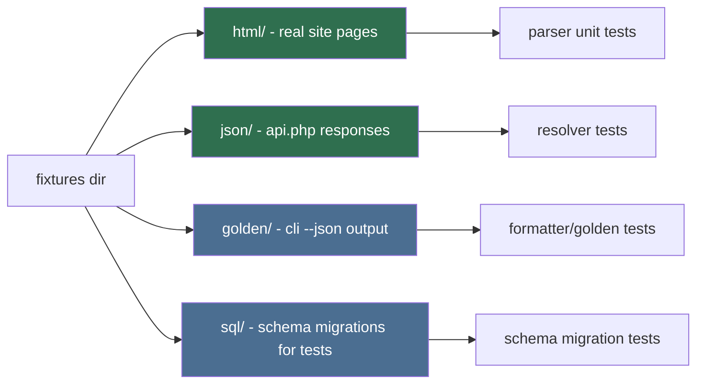

# Fixture Crafter (Sub-agent of: testing)

## Boundary of responsibility

Curate the static inputs tests rely on: scraped HTML pages, mock api.php
responses, sample SQLite schemas, and golden CLI output files.

## Fixture inventory

## Rules

1. HTML fixtures are REAL captures (see `scraper/fixture-engineer`), stored
   once; rev when the site changes.
2. api.php fixtures are paired request/response: `start.json`, `reveal.json`,
   `retry_in.json`, `error.json`.
3. Golden CLI files: one per command for `--json` and one table snapshot;
   regenerate consciously (with review) when output legitimately changes.
4. Every fixture has a small header comment (or `.meta.json`) stating source
   and capture date.

## Definition of done

- All fixtures referenced by tests exist with meta; no test fabricates HTML
  inline when a fixture should exist.
- Golden files regenerate with a documented one-command workflow.