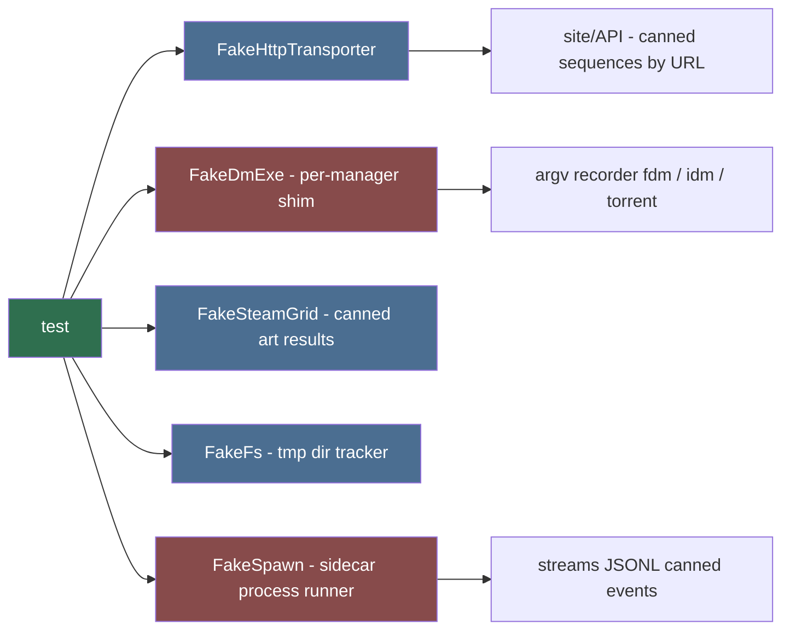

# Mock Engineer (Sub-agent of: testing)

## Boundary of responsibility

Provide deterministic stand-ins for everything a unit test shouldn't really
touch: the go/api.php server, download-manager executables (FDM / IDM /
torrent client), SteamGridDB API, the CLI subprocess (sidecar), the filesystem
boundary, and OS-native shortcut creation.

## Seam map

## Fake inventory (build + document each)

| Fake | Replaces | Records |
|---|---|---|
| `urllib` transport | real HTTP | request url + headers + body, canned response |
| DM exe shim (per manager) | real FDM / IDM / torrent client | argv + capture_code written to file, exit 0 |
| SteamGridDB client | real API | token auth header; canned `search`, `icons` |
| Sidecar spawn runner | real CLI subprocess | argv + canned JSONL event stream → final `result` |
| Native shortcut fakes | OS shortcuts | `.lnk` (win32com), `.desktop` (Linux), `.app`/alias (macOS) call records |
| FS fixture root | real downloads dir | tmp-path tracker |

## Rules

1. Fakes live in `tests/support/`, shared via conftest fixtures.
2. Fakes fail loud on config they don't expect (e.g. an unexpected host slug)
   so real bugs aren't masked.
3. Prefer interface fake over monkeypatching internals: inject the transport /
   process launcher / sidecar runner into the code under test (see
   `.agents/rules/module-architecture.md` seams).
4. Never fake the code under test itself.

## Definition of done

- Every network / DM-spawn / sidecar / shortcut / DB path has a fake asserting
  a bounded call surface.
- A "tofu test" proves the fakes record the exact per-manager argv shapes
  (`fdm -fs url` / `idm /d url /n /p dir` / torrent positional magnet).