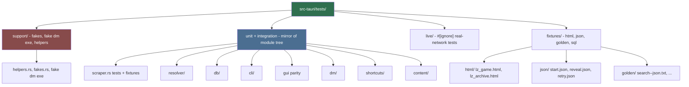
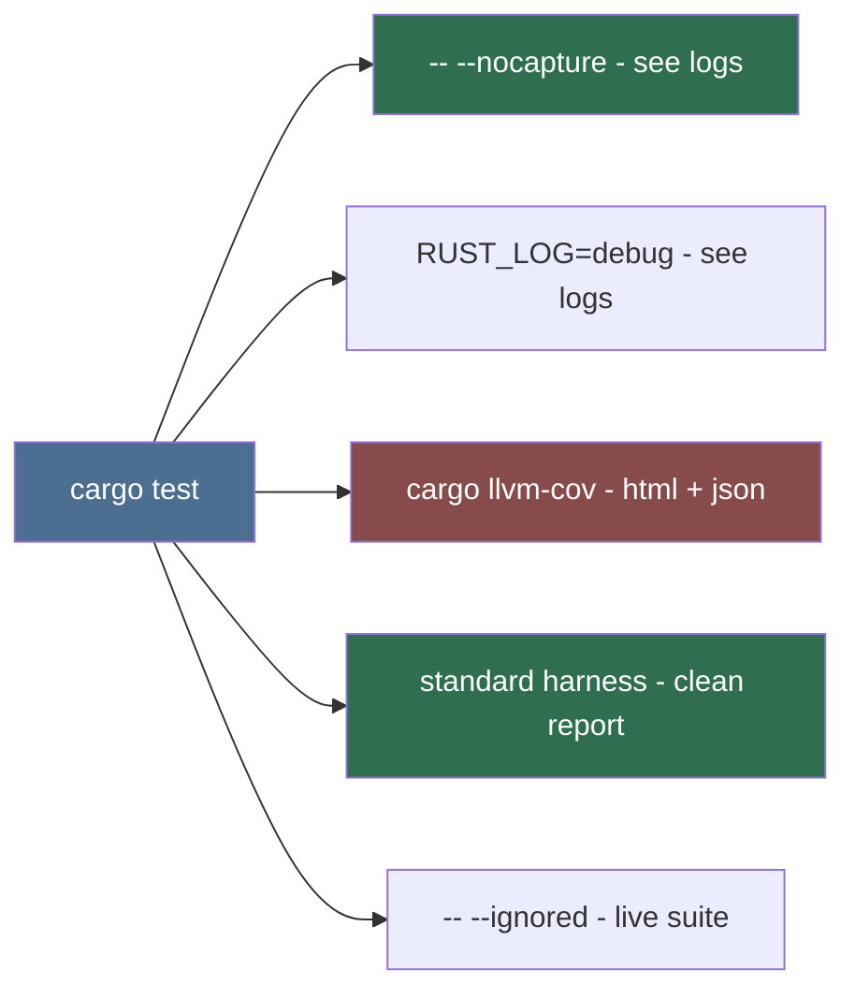

# Test Suite Architect (Sub-agent of: testing)

## Boundary of responsibility

Design and maintain the **test suite as a product**: a modular, fast,
debuggable Rust test suite living in `src-tauri/tests/` that grows with the
codebase, plus a Vitest suite for the Svelte views. Owns suite structure,
shared test helpers, coverage, report tooling, and watch/diagnostics
ergonomics.

## Suite map (Rust core + Svelte views)

| Layer | Location | Purpose |
|---|---|---|
| Rust unit tests | `src-tauri/src/**` `#[cfg(test)]` | fast, offline |
| Rust integration | `src-tauri/tests/` (module-mirror) | wiring, DB, CLI e2e |
| Live (opt-in) | `#[ignore]` tags | real network, keys |
| Svelte unit | `src/**/*.test.ts` via Vitest | view states, logic |
| Golden/parity | `src-tauri/tests/fixtures/golden/` | stable `--json` output |
| Shared fakes | `src-tauri/tests/support/` | fake DM exe, fake HTTP |

## Suite layout (canonical)

Unit/integration tests mirror the module tree under `src-tauri/tests/` so a
failing test's path names the code under test.

## Suite invariants

1. **Deterministic**: no fixtures hit the network; no sleeps; clocks injected
   everywhere.
2. **Isolated**: every test gets fresh in-memory SQLite + empty temp dirs via
   shared test helpers.
3. **Layered execution**: default `cargo test` runs the offline suite; `#[ignore]`
   tags cover live (needs secrets) and platform-specific (Windows-only API)
   tests, skip-guarded via `#[cfg(target_os = ...)]`.
4. **Coverage floors** enforced in CI: `cargo llvm-cov` — core logic
   (parsers, resolver, naming, organizer, exit codes) at >= 90%; view logic
   via Vitest coverage at >= 70%.
5. **Watch mode**: `cargo watch -x test` for Rust; Vitest `--watch` for views.
6. **Focused run guidance**: `cargo test scraper::` / `cargo test -- clique`
   style namespaced runs.

## Debug-grade tooling config

Runbook (document in `src-tauri/tests/README.md`):
- `cargo test` — default offline suite.
- `cargo test -- --ignored` — live tests (keys required).
- `cargo test -- --nocapture` — show stdio/tracing output.
- `cargo llvm-cov` — HTML + JSON coverage report.
- `npm run test` — Vitest suite for views.

## CI wiring

- CI runs the offline suite only. Live (`#[ignore]`) tests run in explicit
  manual jobs.
- Fast feedback: a fast subset (< 10 s) runs on every push; full suite
  nightly.
- On failure, artifacts: coverage report (llvm-cov) published.

## Definition of done

- `src-tauri/tests/` layout above exists with support helpers configured;
  running `cargo test` gives a fast, clean summary.
- `cargo llvm-cov` shows per-module coverage; floors enforced.
- A new feature lands with its unit tests + (if external) fixtures, and the
  watch loop reruns them on save.