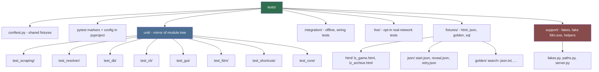
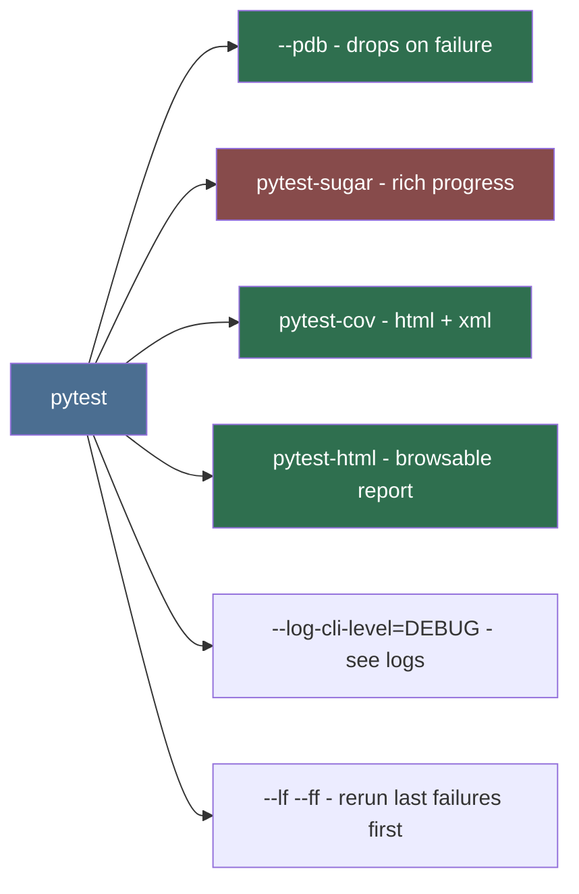

# Test Suite Architect (Sub-agent of: testing)

## Boundary of responsibility

Design and maintain the **test suite as a product**: a vitest-style, modular,
fast, debuggable pytest suite living in a `tests/` subfolder that grows with
the codebase. Owns suite structure, conftest, markers, coverage, report
tooling, and watch/diagnostics ergonomics.

## Vitest-parity goals (what we borrow from the vitest experience)

| Vitest feature | Our pytest equivalent | Purpose |
|---|---|---|
| `*.test.ts` co-located | `tests/unit/<module>/test_<module>.py` | modular, discoverable tests |
| describe/it blocks | `test_` functions + classes | readable spec output |
| watch mode | `pytest-watch` (`ptw`) | auto-rerun on save |
| coverage report | `pytest-cov` + `coverage.xml` | % proof per module |
| UI / rich reporter | `pytest-html`, `pytest-sugar` | readable local output |
| per-test isolation | conftest fixtures + in-memory SQLite | hermetic tests |
| snapshots | golden files (`tests/fixtures/golden/`) | stable CLI/JSON output |
| mocked timers | injected clocks / `freezegun` | deterministic timing tests |

## Suite layout (canonical)

Unit tests mirror the package tree exactly (`tests/unit/scraping/`,
`tests/unit/resolver/`, ...) so a failing test's path names the code under
test. One test file per source module (`test_<module>.py`), except where a
module is tiny and benefits from grouping.

## Suite invariants

1. **Deterministic**: no fixtures hit the network; no `time.sleep` in unit
   tests; clocks injected everywhere.
2. **Isolated**: every test gets fresh in-memory SQLite + empty temp dirs via
   autouse fixtures.
3. **Layered markers**:
   `unit` (fast, default), `integration` (offline wiring), `live` (opt-in,
   needs secrets), `gui` (needs display / xvfb), `windows` (needs Win
   APIs — skip-guarded on non-Windows).
4. **Coverage floors** enforced in CI:
   `--cov lewdzone --cov-fail-under=85` overall, and module-level checks for
   core logic (parsers, resolver, naming, organizer, exit codes) at >= 90%.
5. **Watch mode**: `scripts/test-watch.bat` runs `ptw -- -q` so a dev writes
   code, sees feedback, keeps iterating.
6. **Focused run guidance**: `pytest tests/unit/scraping -k treasure` etc.

## Debug-grade tooling config

Runbook (document in `tests/README.md`):
- `pytest -q` — suite.
- `pytest --lf --ff -q` — rerun failures.
- `pytest --pdb` — drop into debugger at first failure.
- `pytest --report=html` — visual report for sharing.
- `pytest --coverage-report` — open HTML coverage.
- `scripts/test-watch.bat` — watch loop.

## CI wiring

- CI runs `unit + integration` only. `live` and `gui` run in explicit manual
  jobs.
- Fast feedback: a `fast` marker subset (< 10 s) runs on every push; full
  suite nightly.
- On failure, artifacts: coverage report + `pytest-html` report published.

## Definition of done

- `tests/` layout above exists with conftest + markers configured; running
  `pytest -q` gives a fast, colorized summary.
- `--cov` report shows per-module coverage; floors enforced.
- A new feature lands with its unit tests + (if external) fixtures, and the
  watch loop reruns them on save.