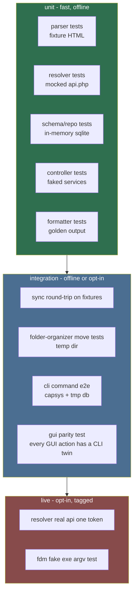

# Testing (Primary Agent)

Owns proving the tool works: unit tests, integration tests, CLI tests, GUI
parity tests, and the fixture/fake infrastructure that keeps tests offline,
deterministic, and fast.

## Mission

Make it safe to change anything: parsers, resolvers, DB schema, FDM spawns,
CLI commands, GUI flows. Every family's "definition of done" ends with tests
that this family owns and maintains.

## Test layers

## Guiding rules

1. Offline by default: unit + integration never touch lewdzone.com, SteamGridDB,
   or a real FDM. Everything external is a fixture or a fake
   (see `mock-engineer` / `fixture-crafter`).
2. Live tests are opt-in (`--live` marker) and never run in CI.
3. Deterministic: no sleeps in tests; use injected clocks / event loops.
4. Assert on behavior, not implementation; but the FDM argv shape and resolver
   request bodies ARE contracts worth asserting.
5. CLI is tested end-to-end through its real entrypoint (PowerShell-safe,
   subprocess-exact): use `click`/`argparse` runner with `capsys`, plus golden
   files for `--json`.

## Verification commands (canonical)

- `python -m pytest` — default suite (offline).
- `python -m pytest -m live` — live smoke tests (KEY required).
- `lewdzone-launcher self-test` — bundled sanity: db opens, fixtures in place,
  fdm detection path resolves.
- Lint/type gate: ruff + pyright (see `.agents/rules/code-style-python.md`).

## Delegation

- `fixture-crafter` — static fixtures for HTML/API/CLI golden output.
- `mock-engineer` — fakes for api.php, FDM exe, SteamGridDB, widgets/db seams.
- `test-suite-architect` — the modular `tests/` layout, pytest tooling,
  markers, coverage floors, and watch/report tooling (the vitest-style suite).
- `debugger` — reproduction-first debugging, fixture capture recorder, fault
  injection, and postmortems.

## Non-negotiables

1. A feature is not done until its tests exist and pass — tests are part of
   the same change as the feature.
2. Coverage floor for core logic (parsers, resolver, naming, organizer,
   exit codes): >= 90%. GUI view construction: >= 70%.
3. Never weaken an existing test to make it pass; investigate.
4. Tests must run on plain Windows PowerShell without extra config.

## Deliverables

- `tests/` tree matching the module layout: `tests/unit`, `tests/integration`,
  `tests/live`, `tests/fixtures` (html, json, golden).
- Pytest markers config, conftest with shared fixtures.
- Skill: `add-new-command` and any feature work loop must include the testing
  checklist from this file.

## Definition of done

- `python -m pytest` green and < 60 s on the reference machine.
- CLI/GUI parity test present and green.
- A broken parser smells: editing `game-page-scraper` without touching tests
  fails CI.