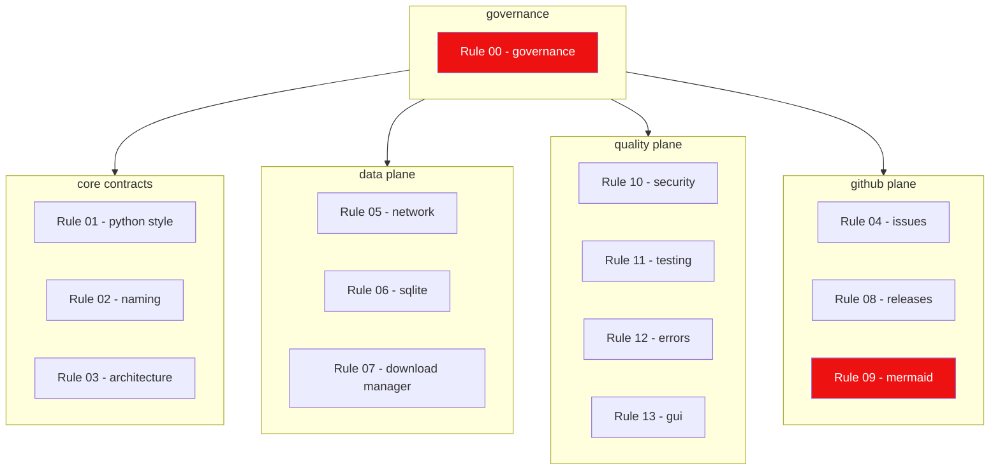

---
name: rule-index
description: Index of every rule (00-13) in the lewdzone-launcher ecosystem, mapping each rule to its owning agents and constrained artifacts.
---

# Rule Index

| # | Rule | Owning agents | Constrains |
| --- | --- | --- | --- |
| `00` | Governance & Delegation | [orchestration in review](../agents/review/review.md) | who does what, when; never duplicate work |
| `01` | Python Code Style | [cli](../agents/cli/cli.md), [database](../agents/database/database.md), [testing](../agents/testing/testing.md), [review](../agents/review/review.md) | all `.py` source |
| `02` | Naming Conventions | [architect](../agents/architect/architect.md), [scraper](../agents/scraper/scraper.md), [database](../agents/database/database.md) | modules, tables, columns, domains, files |
| `03` | Module Architecture | [architect/](../agents/architect/architect.md), [module-contractor](../agents/architect/module-contractor/module-contractor.md) | package layout, import direction, contracts |
| `04` | Remote Issue Protocol | [review](../agents/review/review.md) + HELIX-derived | GitHub issues, sub-issues, PRs, roadmap-first |
| `05` | Network Etiquette | [scraper](../agents/scraper/scraper.md), [resolver](../agents/resolver/resolver.md), [shortcuts](../agents/shortcuts/shortcuts.md) | all HTTP traffic, rate, headers, UA |
| `06` | SQLite Conventions | [database](../agents/database/database.md), [schema-designer](../agents/database/schema-designer/schema-designer.md) | schema, WAL, FK, transactions, migrations |
| `07` | Download Manager Integration | [dm](../agents/dm/dm.md), [dm-detector](../agents/dm/dm-detector/dm-detector.md), [fdm-adapter](../agents/dm/fdm-adapter/fdm-adapter.md), [idm-adapter](../agents/dm/idm-adapter/idm-adapter.md), [torrent-adapter](../agents/dm/torrent-adapter/torrent-adapter.md), [folder-organizer](../agents/dm/folder-organizer/folder-organizer.md) | process spawn, adapters, CLI flags, download folding |
| `08` | Release Standards | [review](../agents/review/review.md) + HELIX-derived | version strings, tags, changelogs, publish |
| `09` | Mermaid Standards | **every agent with a diagram** + HELIX-derived | every ```` ```mermaid ```` block |
| `10` | Security & Secrets | [review](../agents/review/security-auditor/security-auditor.md) | secrets, URLs, SQL injection, process spawn |
| `11` | Testing | [testing](../agents/testing/testing.md), [test-suite-architect](../agents/testing/test-suite-architect/test-suite-architect.md) | tests/ tree, markers, coverage, fixtures |
| `12` | Error Handling & Logging | [cli](../agents/cli/output-formatter/output-formatter.md), [thread-manager](../agents/gui/thread-manager/thread-manager.md) | exceptions, exit codes, stderr, logging |
| `13` | GUI Conventions | [gui](../agents/gui/gui.md), [thread-manager](../agents/gui/thread-manager/thread-manager.md), [tab-designer](../agents/gui/tab-designer/tab-designer.md) | Tk threading, widgets, parity with CLI |



## Enforcement summary

- **Format**: ruff, black-compatible, `pre-commit` (Rule 01).
- **Types**: pyright strict (Rule 01).
- **Architecture**: `import-linter` guards `layers` contract (Rule 03).
- **DB**: migration check in CI (Rule 06).
- **Network**: deterministic fixtures, live tests tagged (Rule 05, Rule 11).
- **Security**: bandit + pip-audit in the review gate (Rule 10).
- **Tests**: `--cov-fail-under=85` overall (Rule 11).
- **GitHub**: issue/PR body checks (Rule 04), tag + notes checks (Rule 08).