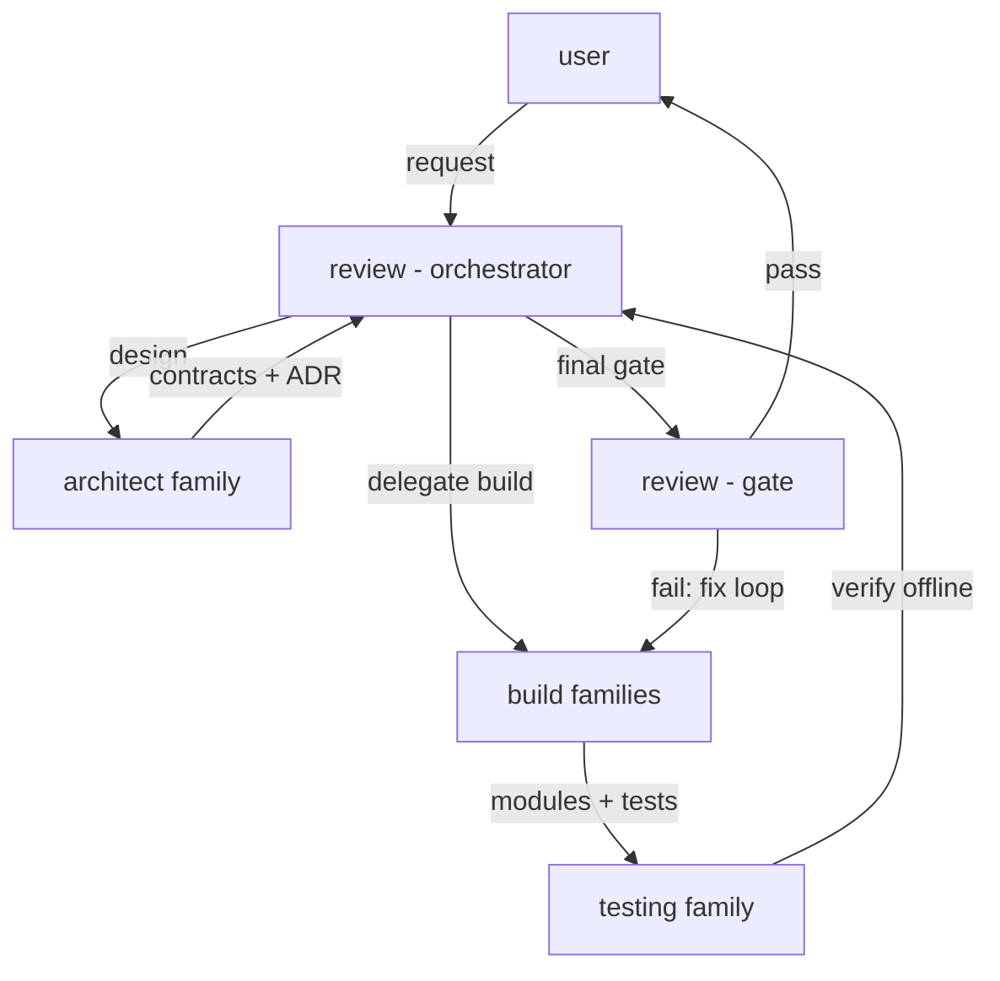

---
name: governance
rule_number: "00"
scope: ecosystem-wide
enforcement: review gate enforces; orchestrator agents comply
---

# Rule 00: Governance & Delegation

Every agent in the lewdzone-launcher ecosystem follows one command chain. No actor
invents scope, duplicates another actor's work, or mutates a contract without
an ADR (see [Rule 03](./rule-03-module-architecture.md)).

## Principles

1. **One owner per artifact.** A file, table, test, or diagram has exactly one
   owning agent (see `.agents/agents/*/`).
2. **Delegation, not speculation.** The `architect` grounds architecture;
   `scraper`/`resolver`/`database`/`dm`/`cli`/`gui`/`shortcuts` build; the
   `testing` family verifies; `review` gates. Agents do not cross these gates
   without delegation.
3. **One core, two entry points.** The GUI and the CLI are entry points over
   the same Rust core controllers. GUI features that bypass the core
   controllers are a governance violation ([Rule 13](./rule-13-gui-conventions.md)).
4. **Rules before code.** No implementation task starts before the rules that
   bind it are written and reviewed.
5. **Fail loudly.** Never swallow errors to "keep the build green". Surface
   them ([Rule 12](./rule-12-error-handling.md)).

## Command chain

## Delegation rules

| From | To | Approval required |
| --- | --- | --- |
| user | review orchestrator | none |
| review orchestrator | architect | yes |
| architect | any build family | contract-lock (ADR) |
| build family | testing family | implementation complete |
| testing family | review gate | test suite green |

## Anti-patterns

- Two agents editing the same module in one task.
- A build agent "fixing" another family's contract unilaterally.
- Adding a `subprocess`/network dependency without [Rule 10](./rule-10-security.md).
- Writing rules after the code they govern already exists (corrective-only).
- GUI directly calling the site, download dispatch, or SQLite (must go through controllers).