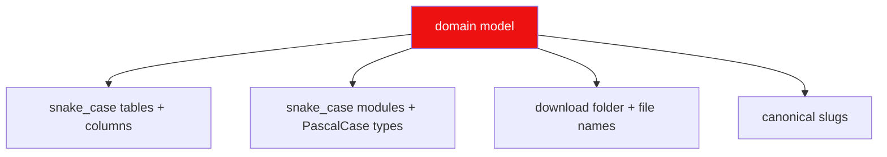

# Rule 02: Naming Conventions

Names are the memory of the system. Everything — modules, tables, columns,
files, download folders, slugs — follows one vocabulary derived from the
canonical models (see [module-contractor](../agents/architect/module-contractor/module-contractor.md)).

## Canonical vocabulary

| Concept | Canonical term | Notes |
| --- | --- | --- |
| lewdzone game | `Game` | domain model, wp post |
| post id on lewdzone | `post_id` | integral, `PostId` |
| game genre | `Genre` | taxonomy term |
| game version | `Version` | display string, e.g. `v1.0117` |
| download variant | `DownloadEntry` | map of official/community + platform + label |
| file host | `Host` | slug from `go.js` ICONS (`fileknot`, `gofile`, ...) |
| go-link token | `GoToken` | `v1.<payload>.<sig>` string |
| download job | `DownloadJob` | queued download task |
| artwork cache | `ArtworkCache` | steamgriddb + platform icon |
| shortcut | `Shortcut` | native: `.lnk`, `.desktop`, `.app` |

## Code identifiers

- DB tables/columns: `snake_case` (single-word tables preferred: `game`,
  `genre`, `version`, `download_entry`, `host`, `download_job`,
  `game_genre`).
- Enums/literals sing their domain: `Platform` in {`PC`, `Android`, `Linux`,
  `Mac`}, `DownloadTab` in {`official`, `community`}, `SortMode` in
  {`popularity`, `new`}, `ScheduleState` in {`running`, `paused`}.
- Controller names: `XController` (e.g. `GameController`, `DownloadController`).

## Files & folders

| What | Pattern | Example |
| --- | --- | --- |
| source module (Rust) | `snake_case.rs` | `resolver.rs` |
| fixtures | `snake_case` in `src-tauri/tests/fixtures/` | `treasure_of_nadia.zip` |
| downloaded game folder | `<Title>/` | `Treasure of Nadia/` |
| game file | `<Title> - <Version> - <Platform>[- <Variant>].<ext>` | `Treasure of Nadia - v1.0117 - Windows (Compressed).zip` |
| part files | `<base> (Part N <Pack>).<ext>` | `... - Windows (Part 1 Compressed).zip` |

## Slugs on disk

- Artwork cache files: `<game_slug>__<type>.<ext>` where type ∈
  {`icon`, `grid`, `hero`, `logo`} (e.g. `treasure_of_nadia__icon.ico`).
- Start-menu folder: `lewdzone` under
  `%APPDATA%\Microsoft\Windows\Start Menu\Programs\` (Windows); Desktop `.desktop`
  entries with `xdg-desktop-menu` on Linux; macOS adds to `~/Applications` or
  the Launchpad via aliases.

## Never

- Two spellings for one host (e.g. `gofile` vs `go_file`).
- Magic numbers where a `post_id`/`game_id` should be used.
- File names that survive no path sanitization (`: * ? " < > |` on Windows;
  `/` and `\` separators on all; see
  [folder-title folding](../agents/dm/folder-organizer/folder-organizer.md)).

