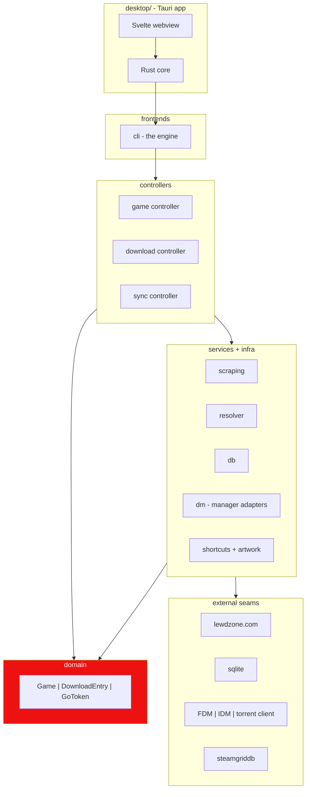

# Rule 03: Module Architecture

lewdzone-launcher is a **modular layered monolith** with two frontends: the
Python **CLI** (the engine) and the **Tauri 2 desktop app** (the primary
product). The app never imports the Python package — it drives the CLI as a
subprocess over JSON/JSONL (Rule 13). Both sit on controllers; controllers own
services; domain knows nothing about IO.

## Layer contract

| Layer | Contains | May import |
| --- | --- | --- |
| `desktop/` (Tauri app) | Rust core + Svelte webview | CLI only via subprocess (never `import lewdzone_launcher`) |
| `lewdzone_launcher/frontends/` | `cli` (argparse) only | controllers only |
| `lewdzone_launcher/controllers/` | `game`, `download`, `sync`, `shortcut`, `artwork` controllers | services + domain |
| `lewdzone_launcher/domain/` | `Game`, `Version`, `DownloadEntry`, `GoToken`, value objects | stdlib only |
| `lewdzone_launcher/services/` | `scraping`, `resolver`, `db`, `dm` (DM adapters), `shortcuts`, `artwork` | domain |
| external | lewdzone.com, download managers (FDM/IDM/torrent), sqlite, SteamGridDB, native shortcuts | — |

**Import rule:** a module may only import from its own layer or one layer
inward. Never import outward; never let domain import services/controllers;
services never import controllers or frontends. The Tauri app is an **external
seam**, not an import — its only channel into the system is the CLI subprocess.



## Contracts & ADRs

1. **Every cross-layer interface is a contract**: documented signature, typed,
   tested at its owner.
2. **Contract change requires an ADR** (see
   [architect](../agents/architect/architect.md) +
   [ADR template](../templates/adr.md)) before implementation. The
   [module-contractor](../agents/architect/module-contractor/module-contractor.md)
   locks contracts in task DAGs.
3. **App/CLI parity contract:** the app's bridge exposes exactly the CLI's
   commands; a GUI-only code path that bypasses the CLI/controllers is a
   Rule 03 + Rule 13 violation.

## Package skeleton

```
lewdzone-launcher/
  src/lewdzone_launcher/
    __init__.py            # __version__
    frontends/cli/
    controllers/
    domain/
    services/{scraping,
              resolver,
              db,
              dm/
                adapters/{fdm,
                          idm,
                          torrent},
              shortcuts,
              artwork}/
    _config.py
  desktop/
    src-tauri/             # Rust core, sidecar externalBin
    src/                   # Svelte + Vite webview
    tauri.conf.json
  tests/
  scratch/                 # gitignored temp scripts
```

## Dependency guards

- `import-linter` `[tool.linter.contracts]` enforces layer boundaries.
- No `sys.path` hacks; project uses `src` layout with installable package.
- Third-party deps: keep small, prefer stdlib (`urllib`, `sqlite3`,
  `subprocess`, `argparse`); Pillow is the sanctioned external addition for
  icon work. Shortcuts use the **native mechanism per OS**
  (`win32com` on Windows `.lnk`, `.desktop` files on Linux, `.app`/aliases on
  macOS — see [shortcuts](../agents/shortcuts/shortcuts.md)).

## Verify

- `import-linter lint`
- `lewdzone-launcher --help` and `lewdzone-launcher <cmd> --json` boot against
  the same controllers under `pytest -m gui` / app-bridge parity smoke.