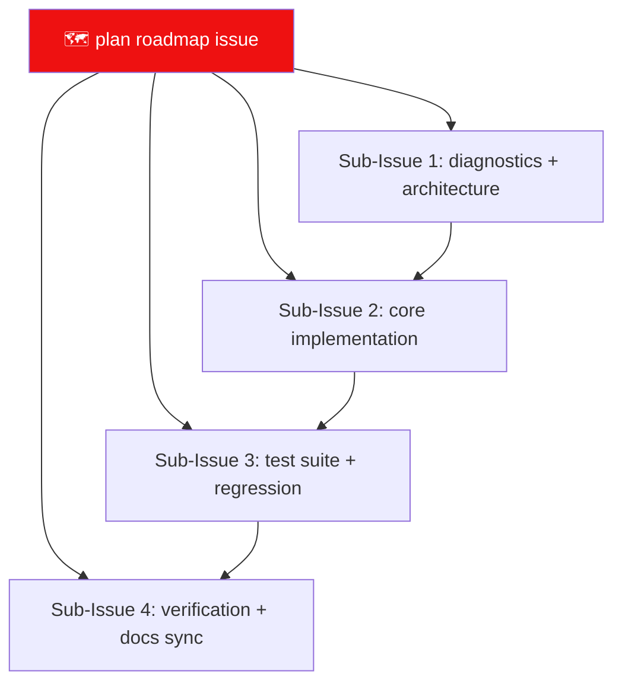

# Rule 04: Remote Issue Protocol

Issue and commit guidelines adapted from
`D:\Projects\HELIX-Discord-Bot`. This rule governs how lewdzone-launcher plans,
tracks, and merges work on GitHub — **roadmap-first, edit-in-place, never
sprawl.**

## Principles

1. **Roadmap-first.** Every plan gets ONE roadmap issue whose first post is the
   COMPLETE LIVING ROADMAP. The first post is edited in place as work
   progresses. Never post new top-level issues for items already listed on a
   roadmap.
2. **One roadmap per plan.** Never fold separate plans into one issue.
3. **Issues before PRs.** Every PR mirrors an issue with `Part of #parent` /
   `Closes #sub-issue`.
4. **Commits follow the commit-message guide.**
5. **Mermaid in every plan/bug issue.** ≥1 GitHub-compatible diagram
   ([Rule 09](./rule-09-mermaid-standards.md)).

## Issue title format

| Kind | Title pattern |
| --- | --- |
| Roadmap/plan | `🗺️ <general plan>` |
| Feature | `✨ <feature overview>` |
| Bug | `🐛 <problem summary>` |
| Sub-issue | `Sub-Issue N: <feature> (#parent)` |
| Discovery / side-change | `🔧 <plain description>` (linked to parent) |

## Rebuild lifecycle (4 sub-issues)



Each sub-issue:
- `Sub-Issue 1` — diagnostics, architecture, ADRs, mermaid diagrams.
- `Sub-Issue 2` — controllers, CLI, GUI, download-manager wiring, sqlite migrations.
- `Sub-Issue 3` — Rust + Vitest test suite, regression, coverage floors.
- `Sub-Issue 4` — verification gate, docs sync, release prep (Rule 08).

## Git commit format

```
<emoji> <type>(<scope>): <subject>

[optional body]

Resolves #<issue> | Closes #<sub-issue>
```

| Emoji | Type | Use |
| --- | --- | --- |
| ✨ | feat | new capabilities |
| 🐛 | fix | bug fixes |
| 📝 | docs | documentation |
| 🧪 | test | tests only |
| ♻️ | refactor | no behavior change |
| ⚡ | perf | performance |
| 🔧 | chore | tooling/config |
| 🔒 | security | security hardening |
| 🏗️ | build | builds/packaging |

**Scopes** for lewdzone-launcher: `scraper`, `resolver`, `db`, `dm`, `cli`, `gui`,
`shortcuts`, `tests`, `agents`, `rules`, `docs`, `deps`.

**Best practices**: imperative present tense; specific scopes; tie to issues;
keep the working tree clean; never commit secrets.

## Body submission mechanics (non-interactive)

- Submit issue/PR/update bodies via `--body-file <utf8file>`, never inline
  unicode/emoji:
  ```bash
  gh issue edit <parent> --body-file roadmap.md
  gh pr create --body-file pr-body.md
  ```
- GitHub CLI (`gh`) is required for all remote operations.

## Verify

- `gh issue view <id> -R owner/repo --json body -q .body` → first post still
  the roadmap, item still present after edits.
- Every PR body references at least one issue (`Part of` or `Closes`).