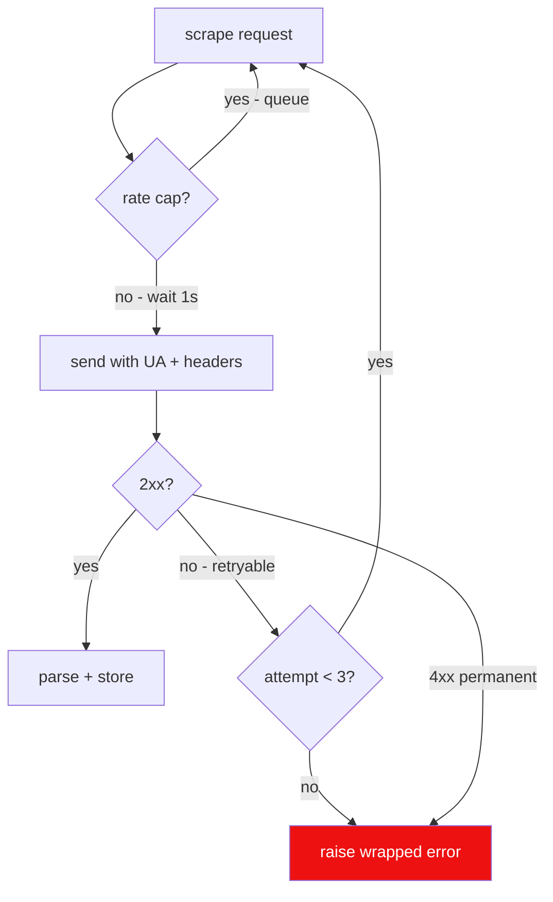

# Rule 05: Network Etiquette

Be a good citizen of lewdzone.com, the go-link API, and SteamGridDB. Respect
rate, spoof nothing that matters, carry real headers, and never hammer.

## Traffic rules

1. **One request per second** per target domain, max (fan-out paced ~1 req/s).
2. **Real browser-ish headers, nothing exotic:** `User-Agent:
   Mozilla/5.0 ...`, plus `Referer: https://lewdzone.com/go/` on API calls (the
   API requires it; see [resolver](../agents/resolver/resolver.md)).
3. **Respect `wait`:** after `api.php` `start` returns `wait: N`, sleep
   `N+1` before `reveal` (the site enforces it; the server returns `retry_in`
   if you're fast).
4. **Timeout + retry:** connect/read timeouts (e.g. 15s), bounded retry with
   backoff (≤3 attempts), wrap HTTP errors into domain errors
   ([Rule 12](./rule-12-error-handling.md)).
5. **Redirect-aware:** WP permalinks 301 → follow; go-links resolve ONLY via
   api.php, never by following the `#fragment` (fragments aren't sent to the
   server).
6. **No parallel fan-out >4** to the same host without a concurrency budget.

## Acceptable surfaces

| Surface | Used by | Notes |
| --- | --- | --- |
| `https://lewdzone.com/games/` | archive-scraper | `?platform=`, `?engine=`, `?sort=`, `?state=` filters |
| `https://lewdzone.com/game-game-genre/<slug>/` | genre archives | — |
| `https://lewdzone.com/game/<slug>/` | game-page-scraper | parse metadata + go-links |
| `https://lewdzone.com/go/api.php` | resolver | `start`→`reveal` two-step |
| `https://www.steamgriddb.com/api/v2/...` | artwork-fetch | Bearer key, `nsfw=yes` for mature |
| `https://lewdzone.com/?p=<id>` | ID sanity | 301 → permalink |

## Anti-patterns

- Scraping `/games/` without the stored archive page fixture for dev.
- Calling `api.php` in tests against the live site (live-only, tagged `#[ignore]`).
- Reusing caller-supplied URLs as targets (allowlist only, see Rule 10).
- Ignoring `cache-control`/`retry_after` hints when present.

