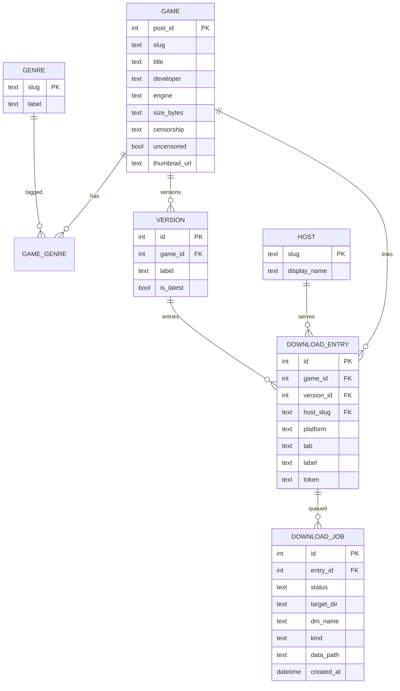

# Rule 06: SQLite Conventions

The catalog and job state live in one SQLite database (`lewdzone.db`,
WAL mode, foreign keys ON). Schema is owned by
[schema-designer](../agents/database/schema-designer/schema-designer.md);
syncing by [sync-orchestrator](../agents/database/sync-orchestrator/sync-orchestrator.md).

## Storage invariants

1. **Store tokens, not resolved URLs.** Persist `GoToken` values and metadata;
   the real URL is time-limited and only obtained via `api.php` at dispatch
   time (see [resolver](../agents/resolver/resolver.md)).
2. **WAL mode:** `PRAGMA journal_mode=WAL`, `PRAGMA foreign_keys=ON`,
   `PRAGMA busy_timeout=5000`.
3. **Single writer connection** for sync; read connections may be shared.
4. **No `SELECT *` in code; no string-built SQL** — parameterized statements
   only (also Rule 10).
5. **Migrations, forward only.** `migrations/NNN_desc.sql` ascending; applied
   in a `schema_migrations` table; CI runs migrations on a scratch DB from
   v0 and asserts schema hash.
6. **Prune only on clean full sync.** Incremental syncs never delete games
   missing from a partial page set.

## Schema (target)

## Transactions & concurrency

- Sync = one transaction per page batch; commit after each page (crash-safe
  incremental resume).
- `INSERT ... ON CONFLICT(post_id/text_key) DO UPDATE` for upserts.
- Reads for CLI listing use a short-lived connection; never hold a cursor
  across UI calls (also Rule 13).

## Verify

- `migrate() --check` in CI runs all migrations on an empty DB and stamps
  `schema_migrations` >= latest.
- Schema drift test: compare `CREATE TABLE` introspection against the expected
  `erDiagram`/DDL fixture.